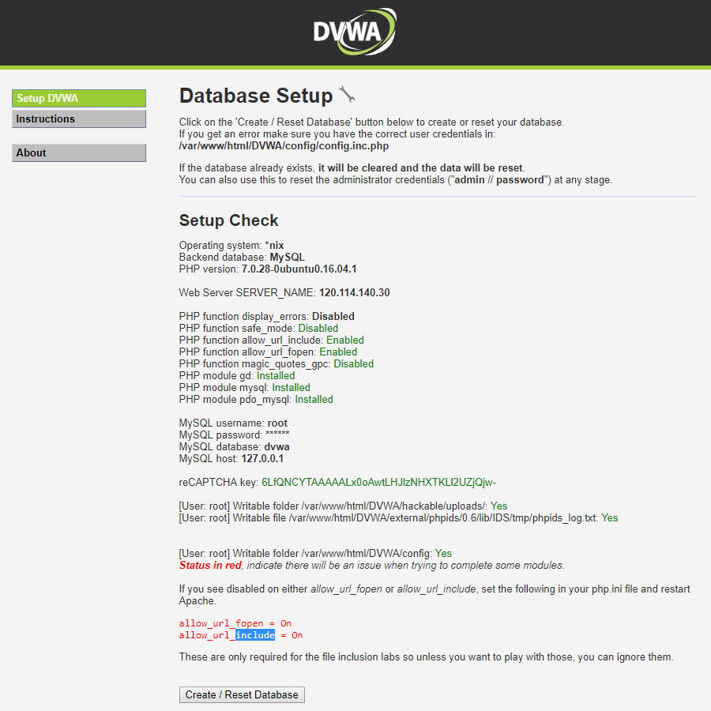

# 期末專案:物聯網設備的攻擊實測
## 建置dvwa測試平台在Raspberry PI 3 websecurity@IOT devices
### 1. 下載安裝檔案
- 可以到樹莓派官網下載許多系統：[https://www.raspberrypi.org/downloads/](https://www.raspberrypi.org/downloads/)
- 下載Ubuntu MATE樹莓派版本：[https://ubuntu-mate.org/download/](https://ubuntu-mate.org/download/)

***
### 2. 安裝系統
- 下載Win32DiskImager燒錄軟體：[https://sourceforge.net/projects/win32diskimager/](https://sourceforge.net/projects/win32diskimager/)
- 將下載的Ubuntu MATE壓縮檔解壓縮
- 開啟Win32DiskImager，選擇目標裝置 > 選擇映像檔 > 按下"寫入資料到「裝置」中"開始燒錄

***
### 3. 安裝/啟動服務
- 安裝WEB服務
```Bash
$ sudo apt-get install apache2 php libapache2-mod-php php-curl php-mcrypt php-mbstring phpunit php-gd -y
```
- 安裝資料庫
```Bash
$ sudo apt-get install mysql-server php-mysqli -y
```
- 啟動Apache
```Bash
$ sudo service apache2 restart
```
***
### 4. 安裝DVWA
- 移動到/var/www/html目錄
```Bash
$ cd /var/www/html/
```
- 下載DVWA網頁
```Bash
$ git clone https://github.com/ethicalhack3r/DVWA.git
```
- 修改設定檔
  - 複製設定檔
```Bash
$ cp DVWA/config/config.inc.php.dist DVWA/config/config.inc.php
```
  - 編輯設定檔  
```Bash
$ vim DVWA/config/config.inc.php
```
  
```php
<?php

# If you are having problems connecting to the MySQL database and all of the variables below are correct
# try changing the 'db_server' variable from localhost to 127.0.0.1. Fixes a problem due to sockets.
#   Thanks to @digininja for the fix.

# Database management system to use
$DBMS = 'MySQL';  # 使用的資料庫服務
#$DBMS = 'PGSQL'; // Currently disabled

# Database variables
#   WARNING: The database specified under db_database WILL BE ENTIRELY DELETED during setup.
#   Please use a database dedicated to DVWA.
#
# If you are using MariaDB then you cannot use root, you must use create a dedicated DVWA user.
#   See README.md for more information on this.
$_DVWA = array();
$_DVWA[ 'db_server' ]   = '127.0.0.1';
$_DVWA[ 'db_database' ] = 'dvwa';  # 資料表
$_DVWA[ 'db_user' ] = 'root';  # 使用者
$_DVWA[ 'db_password' ] = '2727175';  # 使用者密碼

# Only used with PostgreSQL/PGSQL database selection.
$_DVWA[ 'db_port '] = '5432';  # 資料庫port號
# ReCAPTCHA settings
#   Used for the 'Insecure CAPTCHA' module
#   You'll need to generate your own keys at: https://www.google.com/recaptcha/admin/create
#$_DVWA[ 'recaptcha_public_key' ]  = '';
#$_DVWA[ 'recaptcha_private_key' ]  = '';
$_DVWA[ 'recaptcha_public_key' ] = '6LfQNCYTAAAAALx0oAwtLHJlzNHXTKLl2UZjQjw-';  # google recaptcha 公鑰
$_DVWA[ 'recaptcha_private_key' ] = '6LfQNCYTAAAAAHnvqCzw2lG95FD-RfomKHWf7Zob';  # google recaptcha 私鑰

# Default security level
#   Default value for the secuirty level with each session.
#   The default is 'impossible'. You may wish to set this to either 'low', 'medium', 'high' or impossible'.
#$_DVWA[ 'default_security_level' ] = 'impossible';
$_DVWA[ 'default_security_level' ] = 'low';  # DVWA防護階級
   
# Default PHPIDS status
#   PHPIDS status with each session.
#   The default is 'disabled'. You can set this to be either 'enabled' or 'disabled'.
$_DVWA[ 'default_phpids_level' ] = 'disabled';

# Verbose PHPIDS messages
#   Enabling this will show why the WAF blocked the request on the blocked request.
#   The default is 'disabled'. You can set this to be either 'true' or 'false'.
$_DVWA[ 'default_phpids_verbose' ] = 'false';

?>
```
```Bash
$ sudo chmod +777  /var/www/html/DVWA/hackable/uploads/
$ sudo chmod  +777 /var/www/html/DVWA/external/phpids/0.6/lib/IDS/tmp/phpids_log.txt
$ sed -i s/allow_url_fopen = Off/allow_url_fopen = On/g /etc/php/7.0/apache2/php.ini
$ sed -i s/allow_url_include = Off/allow_url_include = On/g /etc/php/7.0/apache2/php.ini
$ sudo service apache2 restart
```
***
### 5. 檢查網頁設定完成並啟動DVWA
看到所有設定成功，就可以點「Create / Reset Database」開始使用DVWA了

***
## 建置Mutillidae測試平台在Raspberry PI 3 websecurity@IOT devices
### 1. 下載網頁
- 移動到/var/www/html
```Bash
$ cd /var/www/html
```
- 下載網址：[https://sourceforge.net/projects/mutillidae/](https://sourceforge.net/projects/mutillidae/)
```Bash
$ sudo wget https://jaist.dl.sourceforge.net/project/mutillidae/mutillidae-project/LATEST-mutillidae-2.6.60.zip --no-check-certificate
```
- 解壓縮檔案
```Bash
$ unzip LATEST-mutillidae-2.6.60.zip
```
***
### 2. 修改設定檔
- 修改資料庫使用者/密碼
```Bash
$ vim mutillidae/includes/database-config.php
```
```php
<?php
define('DB_HOST', '127.0.0.1');
define('DB_USERNAME', 'root');  # 資料庫使用者
define('DB_PASSWORD', '2727175');  # 資料庫使用者密碼
define('DB_NAME', 'mutillidae');  # 資料庫名稱
?>
```
### 3. 開啟網頁測試
- 連結：[http://192.168.10.66/mutillidae](http://192.168.10.66/mutillidae)

