# 期末專案:物聯網設備的攻擊實測
## Web Attacks漏洞測試
### 1.  測試DVWA/Command Injection
- 正常的命令注入測試
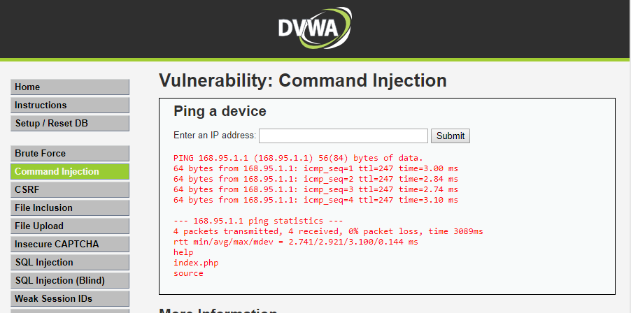

- 有漏洞的命令注入測試
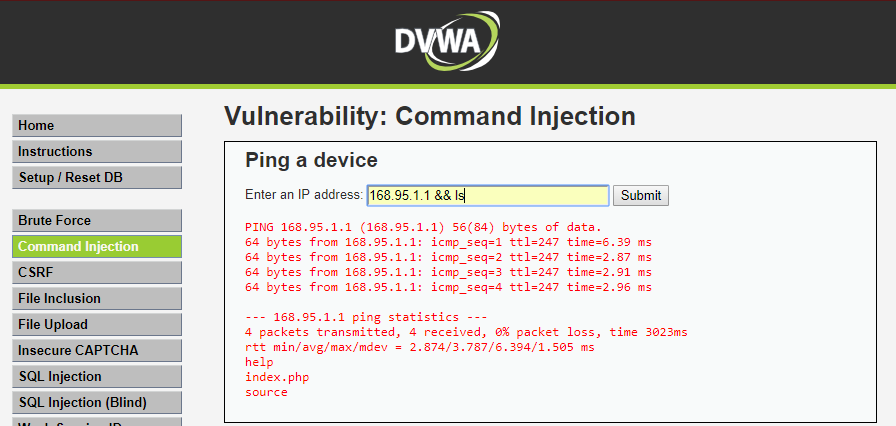
***
####  cat /var/log/apache2/access.log 
```
192.168.10.59 - - [12/Feb/2016:03:22:59 +0800] "GET /DVWA/dvwa/css/main.css HTTP/1.1" 200 1447 "http://120.114.140.30/DVWA/vulnerabilities/exec/" "Mozilla/5.0 (Windows NT 10.0; Win64; x64) AppleWebKit/537.36 (KHTML, like Gecko) Chrome/65.0.3325.181 Safari/537.36"
192.168.10.59 - - [12/Feb/2016:03:22:59 +0800] "GET /DVWA/dvwa/images/logo.png HTTP/1.1" 200 5332 "http://120.114.140.30/DVWA/vulnerabilities/exec/" "Mozilla/5.0 (Windows NT 10.0; Win64; x64) AppleWebKit/537.36 (KHTML, like Gecko) Chrome/65.0.3325.181 Safari/537.36"
192.168.10.59 - - [12/Feb/2016:03:23:20 +0800] "POST /DVWA/vulnerabilities/exec/ HTTP/1.1" 200 1959 "http://120.114.140.30/DVWA/vulnerabilities/exec/" "Mozilla/5.0 (Windows NT 10.0; Win64; x64) AppleWebKit/537.36 (KHTML, like Gecko) Chrome/65.0.3325.181 Safari/537.36"
192.168.10.59 - - [12/Feb/2016:03:23:24 +0800] "GET /DVWA/dvwa/css/main.css HTTP/1.1" 200 1447 "http://120.114.140.30/DVWA/vulnerabilities/exec/" "Mozilla/5.0 (Windows NT 10.0; Win64; x64) AppleWebKit/537.36 (KHTML, like Gecko) Chrome/65.0.3325.181 Safari/537.36"
192.168.10.59 - - [12/Feb/2016:03:23:24 +0800] "GET /DVWA/dvwa/js/dvwaPage.js HTTP/1.1" 200 811 "http://120.114.140.30/DVWA/vulnerabilities/exec/" "Mozilla/5.0 (Windows NT 10.0; Win64; x64) AppleWebKit/537.36 (KHTML, like Gecko) Chrome/65.0.3325.181 Safari/537.36"
192.168.10.59 - - [12/Feb/2016:03:23:24 +0800] "GET /DVWA/dvwa/images/logo.png HTTP/1.1" 200 5332 "http://120.114.140.30/DVWA/vulnerabilities/exec/" "Mozilla/5.0 (Windows NT 10.0; Win64; x64) AppleWebKit/537.36 (KHTML, like Gecko) Chrome/65.0.3325.181 Safari/537.36"
192.168.10.59 - - [12/Feb/2016:03:40:18 +0800] "POST /DVWA/vulnerabilities/exec/ HTTP/1.1" 200 1965 "http://120.114.140.30/DVWA/vulnerabilities/exec/" "Mozilla/5.0 (Windows NT 10.0; Win64; x64) AppleWebKit/537.36 (KHTML, like Gecko) Chrome/65.0.3325.181 Safari/537.36"
192.168.10.59 - - [12/Feb/2016:03:40:21 +0800] "GET /DVWA/dvwa/css/main.css HTTP/1.1" 200 1447 "http://120.114.140.30/DVWA/vulnerabilities/exec/" "Mozilla/5.0 (Windows NT 10.0; Win64; x64) AppleWebKit/537.36 (KHTML, like Gecko) Chrome/65.0.3325.181 Safari/537.36"
192.168.10.59 - - [12/Feb/2016:03:40:21 +0800] "GET /DVWA/dvwa/js/dvwaPage.js HTTP/1.1" 200 811 "http://120.114.140.30/DVWA/vulnerabilities/exec/" "Mozilla/5.0 (Windows NT 10.0; Win64; x64) AppleWebKit/537.36 (KHTML, like Gecko) Chrome/65.0.3325.181 Safari/537.36"
192.168.10.59 - - [12/Feb/2016:03:40:21 +0800] "GET /DVWA/dvwa/images/logo.png HTTP/1.1" 200 5332 "http://120.114.140.30/DVWA/vulnerabilities/exec/" "Mozilla/5.0 (Windows NT 10.0; Win64; x64) AppleWebKit/537.36 (KHTML, like Gecko) Chrome/65.0.3325.181 Safari/537.36"
192.168.10.59 - - [12/Feb/2016:03:40:47 +0800] "POST /DVWA/vulnerabilities/exec/ HTTP/1.1" 200 2845 "http://120.114.140.30/DVWA/vulnerabilities/exec/" "Mozilla/5.0 (Windows NT 10.0; Win64; x64) AppleWebKit/537.36 (KHTML, like Gecko) Chrome/65.0.3325.181 Safari/537.36"
192.168.10.59 - - [12/Feb/2016:03:40:50 +0800] "GET /DVWA/dvwa/js/dvwaPage.js HTTP/1.1" 200 811 "http://120.114.140.30/DVWA/vulnerabilities/exec/" "Mozilla/5.0 (Windows NT 10.0; Win64; x64) AppleWebKit/537.36 (KHTML, like Gecko) Chrome/65.0.3325.181 Safari/537.36"
192.168.10.59 - - [12/Feb/2016:03:40:50 +0800] "GET /DVWA/dvwa/css/main.css HTTP/1.1" 200 1447 "http://120.114.140.30/DVWA/vulnerabilities/exec/" "Mozilla/5.0 (Windows NT 10.0; Win64; x64) AppleWebKit/537.36 (KHTML, like Gecko) Chrome/65.0.3325.181 Safari/537.36"
192.168.10.59 - - [12/Feb/2016:03:40:50 +0800] "GET /DVWA/dvwa/images/logo.png HTTP/1.1" 200 5332 "http://120.114.140.30/DVWA/vulnerabilities/exec/" "Mozilla/5.0 (Windows NT 10.0; Win64; x64) AppleWebKit/537.36 (KHTML, like Gecko) Chrome/65.0.3325.181 Safari/537.36"
192.168.10.59 - - [12/Feb/2016:03:42:18 +0800] "POST /DVWA/vulnerabilities/exec/ HTTP/1.1" 200 1964 "http://120.114.140.30/DVWA/vulnerabilities/exec/" "Mozilla/5.0 (Windows NT 10.0; Win64; x64) AppleWebKit/537.36 (KHTML, like Gecko) Chrome/65.0.3325.181 Safari/537.36"
192.168.10.59 - - [12/Feb/2016:03:42:21 +0800] "GET /DVWA/dvwa/css/main.css HTTP/1.1" 200 1447 "http://120.114.140.30/DVWA/vulnerabilities/exec/" "Mozilla/5.0 (Windows NT 10.0; Win64; x64) AppleWebKit/537.36 (KHTML, like Gecko) Chrome/65.0.3325.181 Safari/537.36"
192.168.10.59 - - [12/Feb/2016:03:42:21 +0800] "GET /DVWA/dvwa/js/dvwaPage.js HTTP/1.1" 200 811 "http://120.114.140.30/DVWA/vulnerabilities/exec/" "Mozilla/5.0 (Windows NT 10.0; Win64; x64) AppleWebKit/537.36 (KHTML, like Gecko) Chrome/65.0.3325.181 Safari/537.36"
192.168.10.59 - - [12/Feb/2016:03:42:21 +0800] "GET /DVWA/dvwa/images/logo.png HTTP/1.1" 200 5332 "http://120.114.140.30/DVWA/vulnerabilities/exec/" "Mozilla/5.0 (Windows NT 10.0; Win64; x64) AppleWebKit/537.36 (KHTML, like Gecko) Chrome/65.0.3325.181 Safari/537.36"
```
***

### 2. 測試DVWA/SQL Injection
- 正常的SQL語法測試:
```sql
SELECT first_name, last_name FROM users WHERE user_id = '1';
```
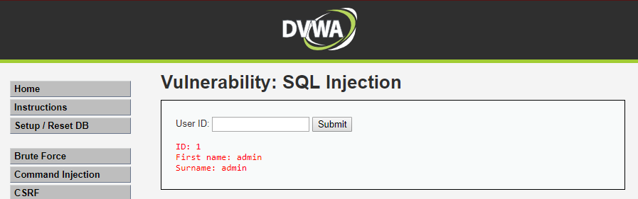

- SQL Injection 漏洞測試 
```sql
SELECT first_name, last_name FROM users WHERE user_id = '1' OR '1'='1';
```
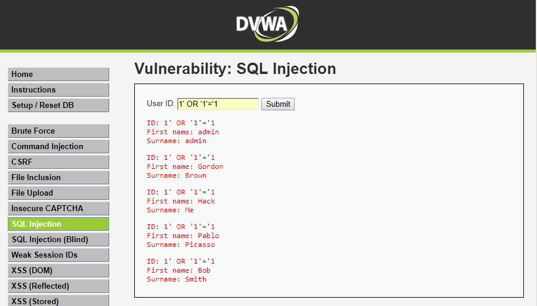
***
#### cat /var/log/apache2/access.log
```
192.168.10.59 - - [12/Feb/2016:04:20:17 +0800] "GET /DVWA/dvwa/images/logo.png HTTP/1.1" 200 5332 "http://120.114.140.30/DVWA/vulnerabilities/sqli/" "Mozilla/5.0 (Windows NT 10.0; Win64; x64) AppleWebKit/537.36 (KHTML, like Gecko) Chrome/65.0.3325.181 Safari/537.36"
192.168.10.59 - - [12/Feb/2016:04:20:17 +0800] "GET /DVWA/vulnerabilities/sqli/ HTTP/1.1" 200 1805 "http://120.114.140.30/DVWA/vulnerabilities/sqli/" "Mozilla/5.0 (Windows NT 10.0; Win64; x64) AppleWebKit/537.36 (KHTML, like Gecko) Chrome/65.0.3325.181 Safari/537.36"
192.168.10.59 - - [12/Feb/2016:04:20:17 +0800] "GET /DVWA/dvwa/css/main.css HTTP/1.1" 200 1447 "http://120.114.140.30/DVWA/vulnerabilities/sqli/" "Mozilla/5.0 (Windows NT 10.0; Win64; x64) AppleWebKit/537.36 (KHTML, like Gecko) Chrome/65.0.3325.181 Safari/537.36"
192.168.10.59 - - [12/Feb/2016:04:20:17 +0800] "GET /DVWA/dvwa/js/dvwaPage.js HTTP/1.1" 200 810 "http://120.114.140.30/DVWA/vulnerabilities/sqli/" "Mozilla/5.0 (Windows NT 10.0; Win64; x64) AppleWebKit/537.36 (KHTML, like Gecko) Chrome/65.0.3325.181 Safari/537.36"
192.168.10.59 - - [12/Feb/2016:04:20:17 +0800] "GET /DVWA/dvwa/images/logo.png HTTP/1.1" 304 183 "http://120.114.140.30/DVWA/vulnerabilities/sqli/" "Mozilla/5.0 (Windows NT 10.0; Win64; x64) AppleWebKit/537.36 (KHTML, like Gecko) Chrome/65.0.3325.181 Safari/537.36"
192.168.10.59 - - [12/Feb/2016:04:20:21 +0800] "GET /DVWA/vulnerabilities/sqli/?id=1%27+OR+%271%27%3D%271&Submit=Submit HTTP/1.1" 200 1885 "http://120.114.140.30/DVWA/vulnerabilities/sqli/" "Mozilla/5.0 (Windows NT 10.0; Win64; x64) AppleWebKit/537.36 (KHTML, like Gecko) Chrome/65.0.3325.181 Safari/537.36"
192.168.10.59 - - [12/Feb/2016:04:20:21 +0800] "GET /DVWA/dvwa/js/dvwaPage.js HTTP/1.1" 200 810 "http://120.114.140.30/DVWA/vulnerabilities/sqli/?id=1%27+OR+%271%27%3D%271&Submit=Submit" "Mozilla/5.0 (Windows NT 10.0; Win64; x64) AppleWebKit/537.36 (KHTML, like Gecko) Chrome/65.0.3325.181 Safari/537.36"
192.168.10.59 - - [12/Feb/2016:04:20:21 +0800] "GET /DVWA/dvwa/css/main.css HTTP/1.1" 200 1447 "http://120.114.140.30/DVWA/vulnerabilities/sqli/?id=1%27+OR+%271%27%3D%271&Submit=Submit" "Mozilla/5.0 (Windows NT 10.0; Win64; x64) AppleWebKit/537.36 (KHTML, like Gecko) Chrome/65.0.3325.181 Safari/537.36"
192.168.10.59 - - [12/Feb/2016:04:20:22 +0800] "GET /DVWA/dvwa/images/logo.png HTTP/1.1" 200 5332 "http://120.114.140.30/DVWA/vulnerabilities/sqli/?id=1%27+OR+%271%27%3D%271&Submit=Submit" "Mozilla/5.0 (Windows NT 10.0; Win64; x64) AppleWebKit/537.36 (KHTML, like Gecko) Chrome/65.0.3325.181 Safari/537.36"
```
***

### 3. 測試DVWA/File Inclusion
- 正常的網頁GET本地文件
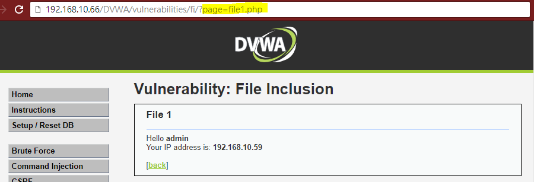

- 有漏洞本地文件測試
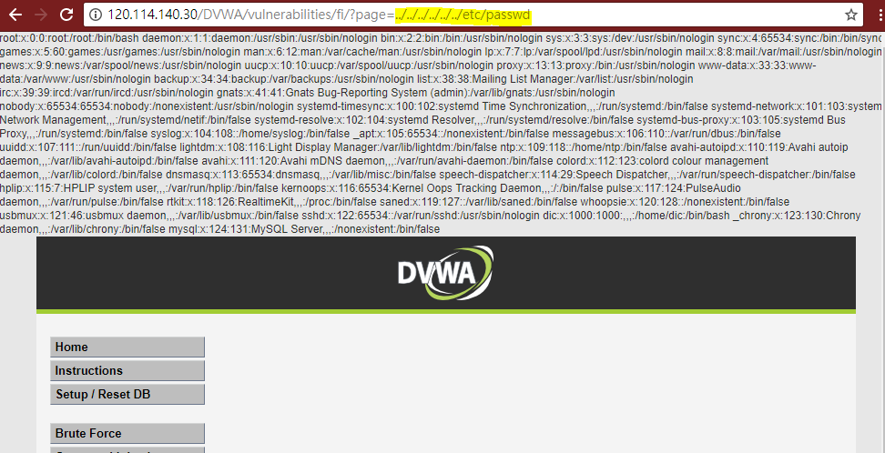
***
#### cat /var/log/apache2/access.log
```
192.168.10.59 - - [12/Feb/2016:04:30:54 +0800] "GET /DVWA/dvwa/js/dvwaPage.js HTTP/1.1" 200 811 "http://120.114.140.30/DVWA/vulnerabilities/fi/?page=../../../../etc/passwd" "Mozilla/5.0 (Windows NT 10.0; Win64; x64) AppleWebKit/537.36 (KHTML, like Gecko) Chrome/65.0.3325.181 Safari/537.36"
192.168.10.59 - - [12/Feb/2016:04:30:54 +0800] "GET /DVWA/dvwa/css/main.css HTTP/1.1" 200 1447 "http://120.114.140.30/DVWA/vulnerabilities/fi/?page=../../../../etc/passwd" "Mozilla/5.0 (Windows NT 10.0; Win64; x64) AppleWebKit/537.36 (KHTML, like Gecko) Chrome/65.0.3325.181 Safari/537.36"
192.168.10.59 - - [12/Feb/2016:04:30:54 +0800] "GET /DVWA/dvwa/images/logo.png HTTP/1.1" 200 5332 "http://120.114.140.30/DVWA/vulnerabilities/fi/?page=../../../../etc/passwd" "Mozilla/5.0 (Windows NT 10.0; Win64; x64) AppleWebKit/537.36 (KHTML, like Gecko) Chrome/65.0.3325.181 Safari/537.36"
192.168.10.59 - - [12/Feb/2016:04:31:01 +0800] "GET /DVWA/vulnerabilities/fi/?page=../../../../../etc/passwd HTTP/1.1" 200 1457 "-" "Mozilla/5.0 (Windows NT 10.0; Win64; x64) AppleWebKit/537.36 (KHTML, like Gecko) Chrome/65.0.3325.181 Safari/537.36"
192.168.10.59 - - [12/Feb/2016:04:31:01 +0800] "GET /DVWA/dvwa/js/dvwaPage.js HTTP/1.1" 200 811 "http://120.114.140.30/DVWA/vulnerabilities/fi/?page=../../../../../etc/passwd" "Mozilla/5.0 (Windows NT 10.0; Win64; x64) AppleWebKit/537.36 (KHTML, like Gecko) Chrome/65.0.3325.181 Safari/537.36"
192.168.10.59 - - [12/Feb/2016:04:31:01 +0800] "GET /DVWA/dvwa/images/logo.png HTTP/1.1" 200 5332 "http://120.114.140.30/DVWA/vulnerabilities/fi/?page=../../../../../etc/passwd" "Mozilla/5.0 (Windows NT 10.0; Win64; x64) AppleWebKit/537.36 (KHTML, like Gecko) Chrome/65.0.3325.181 Safari/537.36"
192.168.10.59 - - [12/Feb/2016:04:31:01 +0800] "GET /DVWA/dvwa/css/main.css HTTP/1.1" 200 1447 "http://120.114.140.30/DVWA/vulnerabilities/fi/?page=../../../../../etc/passwd" "Mozilla/5.0 (Windows NT 10.0; Win64; x64) AppleWebKit/537.36 (KHTML, like Gecko) Chrome/65.0.3325.181 Safari/537.36"
192.168.10.59 - - [12/Feb/2016:04:31:07 +0800] "GET /DVWA/vulnerabilities/fi/?page=../../../../../../etc/passwd HTTP/1.1" 200 2345 "-" "Mozilla/5.0 (Windows NT 10.0; Win64; x64) AppleWebKit/537.36 (KHTML, like Gecko) Chrome/65.0.3325.181 Safari/537.36"
192.168.10.59 - - [12/Feb/2016:04:31:07 +0800] "GET /DVWA/dvwa/js/dvwaPage.js HTTP/1.1" 200 811 "http://120.114.140.30/DVWA/vulnerabilities/fi/?page=../../../../../../etc/passwd" "Mozilla/5.0 (Windows NT 10.0; Win64; x64) AppleWebKit/537.36 (KHTML, like Gecko) Chrome/65.0.3325.181 Safari/537.36"
192.168.10.59 - - [12/Feb/2016:04:31:07 +0800] "GET /DVWA/dvwa/images/logo.png HTTP/1.1" 200 5332 "http://120.114.140.30/DVWA/vulnerabilities/fi/?page=../../../../../../etc/passwd" "Mozilla/5.0 (Windows NT 10.0; Win64; x64) AppleWebKit/537.36 (KHTML, like Gecko) Chrome/65.0.3325.181 Safari/537.36"
192.168.10.59 - - [12/Feb/2016:04:31:07 +0800] "GET /DVWA/dvwa/css/main.css HTTP/1.1" 200 1447 "http://120.114.140.30/DVWA/vulnerabilities/fi/?page=../../../../../../etc/passwd" "Mozilla/5.0 (Windows NT 10.0; Win64; x64) AppleWebKit/537.36 (KHTML, like Gecko) Chrome/65.0.3325.181 Safari/537.36"
```
### 4.  測試DVWA/File Upload
上傳的文件對應用程序造成重大風險。許多攻擊的第一步是向系統獲取一些攻擊代碼。那麼攻擊只需要找到一種方法來執行代碼
- 撰寫有代碼的攻擊檔案
```php
<?php
	echo exec('whoami');
?>
```
- 上傳具有攻擊的檔案
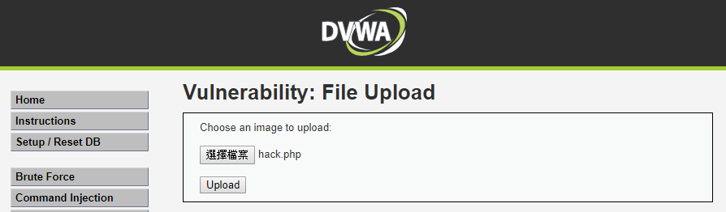
- 成功上傳
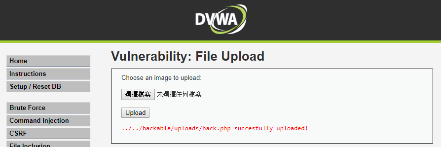
- 執行上傳後的檔案	
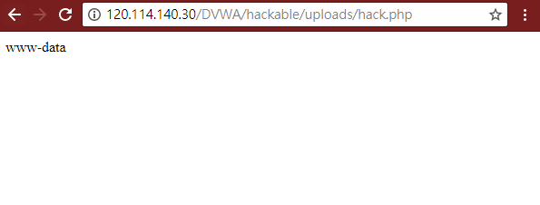
***
#### cat /var/log/apache2/access.log
```
192.168.10.59 - - [12/Feb/2016:05:09:50 +0800] "GET /DVWA/dvwa/images/logo.png HTTP/1.1" 200 5332 "http://120.114.140.30/DVWA/vulnerabilities/upload/" "Mozilla/5.0 (Windows NT 10.0; Win64; x64) AppleWebKit/537.36 (KHTML, like Gecko) Chrome/65.0.3325.181 Safari/537.36"
192.168.10.59 - - [12/Feb/2016:05:09:50 +0800] "GET /DVWA/vulnerabilities/upload/ HTTP/1.1" 200 1784 "http://120.114.140.30/DVWA/vulnerabilities/upload/" "Mozilla/5.0 (Windows NT 10.0; Win64; x64) AppleWebKit/537.36 (KHTML, like Gecko) Chrome/65.0.3325.181 Safari/537.36"
192.168.10.59 - - [12/Feb/2016:05:09:50 +0800] "GET /DVWA/dvwa/css/main.css HTTP/1.1" 200 1447 "http://120.114.140.30/DVWA/vulnerabilities/upload/" "Mozilla/5.0 (Windows NT 10.0; Win64; x64) AppleWebKit/537.36 (KHTML, like Gecko) Chrome/65.0.3325.181 Safari/537.36"
192.168.10.59 - - [12/Feb/2016:05:09:50 +0800] "GET /DVWA/dvwa/js/dvwaPage.js HTTP/1.1" 200 810 "http://120.114.140.30/DVWA/vulnerabilities/upload/" "Mozilla/5.0 (Windows NT 10.0; Win64; x64) AppleWebKit/537.36 (KHTML, like Gecko) Chrome/65.0.3325.181 Safari/537.36"
192.168.10.59 - - [12/Feb/2016:05:09:50 +0800] "GET /DVWA/dvwa/images/logo.png HTTP/1.1" 304 183 "http://120.114.140.30/DVWA/vulnerabilities/upload/" "Mozilla/5.0 (Windows NT 10.0; Win64; x64) AppleWebKit/537.36 (KHTML, like Gecko) Chrome/65.0.3325.181 Safari/537.36"
192.168.10.59 - - [12/Feb/2016:05:11:15 +0800] "POST /DVWA/vulnerabilities/upload/ HTTP/1.1" 200 1815 "http://120.114.140.30/DVWA/vulnerabilities/upload/" "Mozilla/5.0 (Windows NT 10.0; Win64; x64) AppleWebKit/537.36 (KHTML, like Gecko) Chrome/65.0.3325.181 Safari/537.36"
192.168.10.59 - - [12/Feb/2016:05:11:15 +0800] "GET /DVWA/dvwa/js/dvwaPage.js HTTP/1.1" 200 811 "http://120.114.140.30/DVWA/vulnerabilities/upload/" "Mozilla/5.0 (Windows NT 10.0; Win64; x64) AppleWebKit/537.36 (KHTML, like Gecko) Chrome/65.0.3325.181 Safari/537.36"
192.168.10.59 - - [12/Feb/2016:05:11:15 +0800] "GET /DVWA/dvwa/css/main.css HTTP/1.1" 200 1447 "http://120.114.140.30/DVWA/vulnerabilities/upload/" "Mozilla/5.0 (Windows NT 10.0; Win64; x64) AppleWebKit/537.36 (KHTML, like Gecko) Chrome/65.0.3325.181 Safari/537.36"
192.168.10.59 - - [12/Feb/2016:05:11:15 +0800] "GET /DVWA/dvwa/images/logo.png HTTP/1.1" 200 5332 "http://120.114.140.30/DVWA/vulnerabilities/upload/" "Mozilla/5.0 (Windows NT 10.0; Win64; x64) AppleWebKit/537.36 (KHTML, like Gecko) Chrome/65.0.3325.181 Safari/537.36"
192.168.10.59 - - [12/Feb/2016:05:12:41 +0800] "GET /DVWA/hackable/uploads/hack.php HTTP/1.1" 200 211 "-" "Mozilla/5.0 (Windows NT 10.0; Win64; x64) AppleWebKit/537.36 (KHTML, like Gecko) Chrome/65.0.3325.181 Safari/537.36"
189.46.194.243 - - [12/Feb/2016:05:16:57 +0800] "GET / HTTP/1.1" 200 11578 "-" "Mozilla/5.0 (Windows NT 10.0; WOW64) AppleWebKit/537.36 (KHTML, like Gecko) Chrome/52.0.2743.116 Safari/537.36"
```
***
## 安裝modsecurity
mod_security 是 Apache 的保安模組，可以預防多種針對網頁的攻擊，例如執行遠端程式碼, SQL Injection，路徑掃瞄等。
### 1. 安裝並設定
```zsh
sudo apt-get update	# 更新資料庫
sudo apt-get install libapache2-modsecurity -y  # 安裝modesecurity

sudo  service apache2 reload	# 重新啟動apache
sudo apachectl -M | grep --color security2	# 檢查是否安裝並啟動完成

sudo mv /etc/modsecurity/modsecurity.conf-recommended /etc/modsecurity/modsecurity.conf		# 更改設定檔的副檔名
sudo service apache2 reload	# 重新啟動apache

sudo sed -i "s/SecRuleEngine DetectionOnly/SecRuleEngine On/" /etc/modsecurity/modsecurity.conf		#開啟ModSecurity防火牆。它會檢測並阻止該服務器上的任何惡意攻擊
sudo sed -i "s/SecResponseBodyAccess On/SecResponseBodyAccess Off/" /etc/modsecurity/modsecurity.conf	#它會告訴ModSecurity是否會檢查請求。
```
### 2. 新增造訪路徑攻擊字串的規則 
```Bash
sudo vim /etc/apache2/mods-enabled/security2.conf
```
```
<IfModule security2_module>
        # Default Debian dir for modsecurity's persistent data
        SecDataDir /var/cache/modsecurity

        # Include all the *.conf files in /etc/modsecurity.
        # Keeping your local configuration in that directory
        # will allow for an easy upgrade of THIS file and
        # make your life easier
        IncludeOptional /etc/modsecurity/*.conf
        IncludeOptional "/usr/share/modsecurity-crs/*.conf"
        IncludeOptional "/usr/share/modsecurity-crs/activated_rules/*.conf"	#mod_security 的規則設定檔都放在這個目錄
</IfModule>
```
### 3. 複製規則到目錄
```Bash
sudo cp /usr/share/modsecurity-crs/base_rules/modsecurity_crs_41_sql_injection_attacks.conf /usr/share/modsecurity-crs/activated_rules/
sudo service apache2 reload	#重新啟動apache
```
### 4. SQL Injection 防護測試
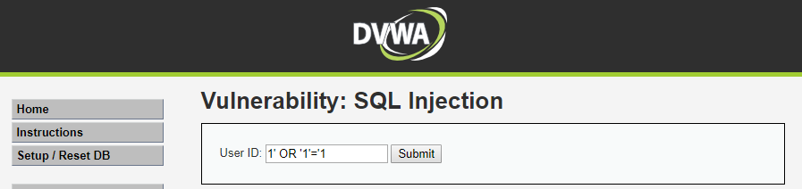
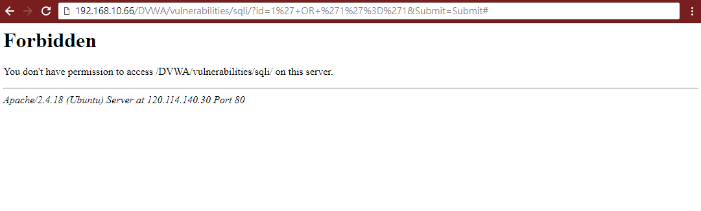
***
- 基本的規則都放在/usr/share/modsecurity-crs/base_rules

|                    防護規則                       |                                     概要                                        |
| ------------------------------------------------ | ------------------------------------------------------------------------------- |
| modsecurity_35_bad_robots.data                   | 惡意爬蟲規則                                                                     |
| modsecurity_35_scanners.data                     | 惡意掃描器規則                                                                   |
| modsecurity_40_generic_attacks.data              | 常見的攻擊例如命令執行(代碼執行、注入、文件包含、敏感信息洩露、HTTP響應拆分等相關規則) |
| modsecurity_50_outbound.data                     | 檢測response_body中的錯誤信息，警告信息，列目錄信息                                 |
| modsecurity_50_outbound_malware.data             | 檢測response_body中的錯誤信息，警告信息，列目錄信息                                 |
| modsecurity_crs_20_protocol_violations.conf      | HTTP協議規範相關規則                                                              |
| modsecurity_crs_21_protocol_anomalies.conf       | HTTP協議規範相關規則                                                              |
| modsecurity_crs_23_request_limits.conf           | HTTP協議大小長度限制相關規則                                                      |
| modsecurity_crs_30_http_policy.conf              | HTTP協議白名單相關規則                                                            |
| modsecurity_crs_35_bad_robots.conf               | 惡意掃描器與爬蟲規則                                                              |
| modsecurity_crs_40_generic_attacks.conf          | 常見的攻擊例如命令執行(代碼執行、注入、文件包含、敏感信息洩露、HTTP響應拆分等相關規則) |
| modsecurity_crs_41_sql_injection_attacks.conf    | SQL注入相關規則                                                                  | 
| modsecurity_crs_41_xss_attacks.conf              | XSS相關規則                                                                      |
| modsecurity_crs_42_tight_security.conf           | 目錄遍歷相關規則                                                                  |
| modsecurity_crs_45_trojans.conf                  | webshell相關規則                                                                 |
| modsecurity_crs_47_common_exceptions.conf        | Apache異常相關規則                                                               |
| modsecurity_crs_48_local_exceptions.conf.example |                                                                                 |
| modsecurity_crs_49_inbound_blocking.conf         | 協同防禦相關規則                                                                  |
| modsecurity_crs_50_outbound.conf                 | 檢測response_body中的錯誤信息，警告信息，列目錄信息                                 |
| modsecurity_crs_59_outbound_blocking.conf        | 協同防禦相關規則                                                                  |
| modsecurity_crs_60_correlation.conf              | 協同防禦相關規則                                                                  |
***


