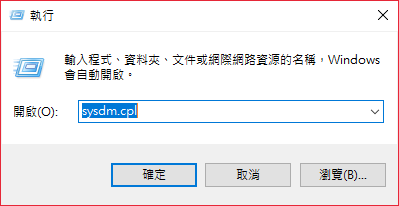
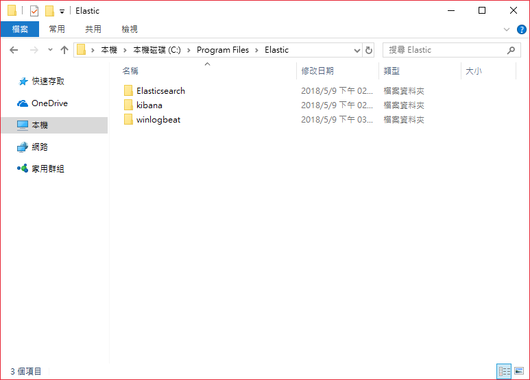

# 系統架構


# 本次實測軟體
> - elaticsearch: Elasticsearch 是一個即時的分佈式搜索分析引擎， 它能讓你以一個之前從未有過的速度和規模，去探索你的數據。它被用作全文檢索、結構化搜   索、分析以及這三個功能的組合。
> - kibana: 視覺與圖形化的表示方式來顯示各種log。
> - winlogbeat(windows)、logstash(linux): 幫助收集各地的log或是資訊，並且根據你的格式，轉換成各種資料欄位。

# 環境需求
## JAVA 8
### 1. 下載與安裝
- 下載網址: [http://www.oracle.com/technetwork/java/javase/downloads/jdk8-downloads-2133151.html](http://www.oracle.com/technetwork/java/javase/downloads/jdk8-downloads-2133151.html)
  
### 2. 設定Java開發環境
Step1. 按下鍵盤『windows鍵+R』，開啟『執行』對話框，輸入『sysdm.cpl』，按下『確定』
  
Step2. 在系統內容視窗中，點選如下圖所示的『進階』頁籤，及點擊『環境變數』  
  
Step3. 在底下的系統變數中選擇Path，按下底下的『編輯』
  
Step4. 點擊右邊的『新增』，輸入安裝的路徑，預設應該是"C:\Program Files\Java\jdk1.8.0_171\bin"，之後按下『確定』 
   
### 3. 檢查設定成功
```cmd
javac -version
```


# 安裝伺服器系統
Elasticsearch + Kibana
## 安裝 Elasticsearch
下載網址: https://artifacts.elastic.co/downloads/elasticsearch/elasticsearch-6.2.4.msi
### 開始安裝
Step1.  

Step2.  

Step3.  

### 啟動服務
- 使用cmd移動到"C:\Program Files\Elastic\Elasticsearch\6.2.4\bin"
```cmd
cd 'C:\Program Files\Elastic\Elasticsearch\6.2.4\bin'
```
- 執行啟動
```cmd
./elasticsearch.exe
```
### 檢查測試
- 在網站URL: [http://localhost:9200/](http://localhost:9200/)   


## 安裝 Kibana
### 下載安裝
- 下載網址: https://artifacts.elastic.co/downloads/kibana/kibana-6.2.4-windows-x86_64.zip
- 解壓縮後，我是將目錄與Elasticsearch放在同一層的目錄(C:\Program Files\Elastic)，並且將目錄去除後面的版本名稱

### 修改設定值
- 修改kibana目錄的config/kibana.yml  
將`server.host`的註解拿掉，並把裡面的"localhost"換成"0.0.0.0"。
```yml
server.host: "0.0.0.0"  # 0.0.0.0 表示綁定所有 IP
```


